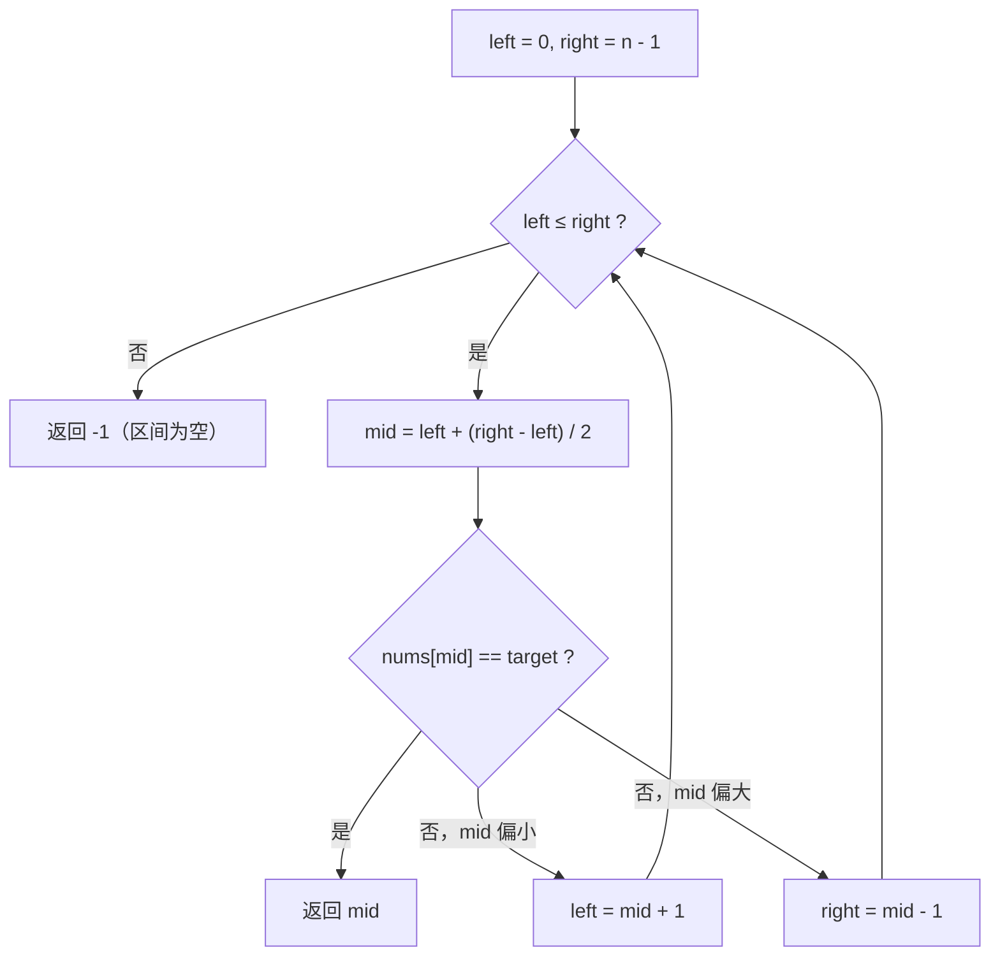

二分查找大概是「看着最简单、写着最容易错」的算法——没有之一。
`while` 条件用 `<` 还是 `<=`？`right` 是 `n-1` 还是 `n`？更新时要不要 `+1`？
这些问题之所以反复出错，是因为大多数人在**背模板，而不是维护不变量**。

## 核心思想：一条不变量

把整个算法压缩成一句话：

> **循环的每一轮，目标如果存在，一定在闭区间 $[left, right]$ 里。**

这就是不变量（invariant）。所有边界问题的答案都从它推导：

- `while left <= right`：因为 `left == right` 时区间仍有一个元素，必须继续检查；
- `left = mid + 1`、`right = mid - 1`：因为 `mid` 已检查过，必须彻底踢出区间；
- 结束后 `left == right + 1`，区间为空——可以安全地宣布「没找到」。

## 决策流程



> [!TIP]
> 求中点用 `left + (right - left) / 2` 而不是 `(left + right) / 2`：
> 后者在其他语言里可能溢出（Java/C++ 教科书 bug），JS 的整数范围足够大但仍建议养成习惯。

## 标准实现

```ts title="binary-search.ts"
function binarySearch(nums: number[], target: number): number {
  let left = 0;
  let right = nums.length - 1; // 闭区间 [left, right]

  while (left <= right) {
    const mid = left + ((right - left) >> 1);
    if (nums[mid] === target) return mid;
    if (nums[mid] < target) left = mid + 1;
    else right = mid - 1;
  }
  return -1; // 不变量保证：走到这里区间必为空
}
```

## 变体统一：找左边界

真正的考验是「有序数组中**第一个** $\geq$ target 的位置」（lower bound）。
关键洞察：**把「等于」也归入一侧**，把四种变体统一成一个模板。

```ts title="lower-bound.ts" ins={8}
function lowerBound(nums: number[], target: number): number {
  let left = 0;
  let right = nums.length; // 注意：左闭右开 [left, right)

  while (left < right) {
    const mid = left + ((right - left) >> 1);
    if (nums[mid] < target) left = mid + 1; // mid 及其左侧全部淘汰
    else right = mid;                       // mid 可能是答案，不能踢掉
  }
  return left; // 收敛到第一个 >= target 的位置
}
```

只有两处不同，而且都有明确的「为什么」：

1. `right = n` 而不是 `n - 1`——答案可能等于 `n`（所有元素都小于 target 时，插入点在末尾）；
2. `right = mid` 而不是 `mid - 1`——`nums[mid] >= target` 时 mid **可能就是答案**，
   踢掉它就会错过。

| 变体 | while 条件 | 淘汰动作 | 收敛结果 |
| ---- | :--: | :--: | :--: |
| 找精确值 | `left <= right` | `mid ± 1` | 命中下标或 -1 |
| lower bound | `left < right` | `mid + 1` / `mid` | 第一个 $\geq$ target |
| upper bound | `left < right` | `mid + 1` / `mid` | 第一个 $>$ target |
| 找最右 | `left < right` | `mid + 1` / `mid` | 最后一个 $\leq$ target |

> [!IMPORTANT]
> 判断一个二分实现是否正确，不需要跑用例，只需要回答两个问题：
> **不变量是什么？** 和 **每一轮淘汰后，不变量还成立吗？**
> 两个问题都有答案，代码几乎不可能是错的。

## 复杂度

时间复杂度 $\mathcal{O}(\log n)$：每轮把搜索空间减半，
$n$ 个元素最多 $\lceil \log_2 n \rceil + 1$ 轮。空间复杂度 $\mathcal{O}(1)$（迭代版）。

一个常被忽略的事实：`log₂(10⁹) ≈ 30`。**十亿个元素，30 次比较。**
这就是「有序性」这个前提能兑换的惊人收益——也是为什么数据库索引、
git bisect、系统调参都用它。

> [!CAUTION]
> 二分的前提是**有序**（更准确地：单调判定）。数组无序却二分，结果不是「不稳定」，
> 而是彻底错误——前提条件的遵守永远排在技巧之前。
