前段时间刷到一张 B 站视频截图，博主把 2026 年 27 个主流大模型的架构选型做成了一张大表格，配文是"这些组合也全都被玩完了"。这张表信息密度很高，但视频里一晃而过，看得人手痒。于是我把它抄下来，逐行去核对了官方技术报告和模型配置，整理成这篇文章：一张汇总大表，加上每个模块的技术方案详解，能找到论文的都贴了论文地址。

先说核对结论：表格绝大部分和公开资料对得上。有两处需要留意——DeepSeek V4-Pro 那一行被视频水印挡住了激活参数（论文和 SemiAnalysis 给的数字是 49B），V4-Pro 的注意力列在论文里写的是 CSA+HCA 混合，截图上该行 Attention2 为空、只有 V4-Flash 标了 CSA/HCA，我在表格里按截图转录并加了脚注。除此之外没有发现硬伤。

配图说明：文中架构图除特别标注外，取自 Sebastian Raschka 的[《The Big LLM Architecture Comparison》](https://magazine.sebastianraschka.com/p/the-big-llm-architecture-comparison)和各模型论文，版权归原作者。这篇文章的表格数据以截图为准、以官方报告为准做了交叉核对。

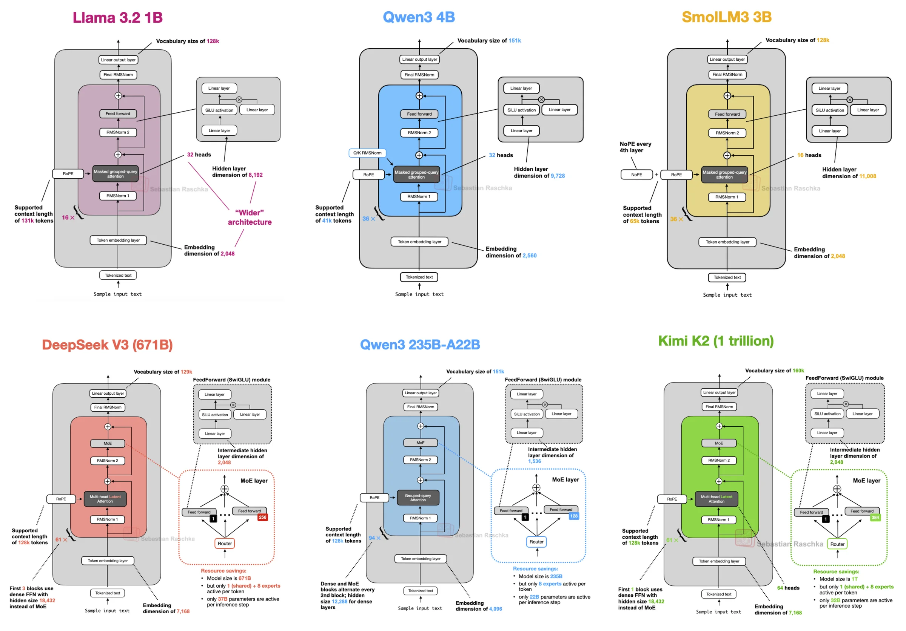

:::caption
Raschka 整理的架构分支图。左上是标准 Transformer 系，右下的 hybrid 模型们是 2026 年的新势力。
:::

## 汇总大表

列的含义先交代一下：FFN 列的 Sparse 指 MoE（每 token 只激活部分专家）、Dense 指稠密前馈；归一化列合并了 Pre-Norm / Post-Norm / Attention 内部的 Norm 三个位置；Attention 列按"主要机制 + 辅助机制"写，比例我标在括号里。编号沿用截图里的行号，截图只拍到第 41 行起，前面 40 行是 2025 年及更早的模型，这篇文章只整理 2026 年的部分。

| #   | 模型                       | 发布日期   | FFN    | 上下文 | 参数（总/激活） | 归一化                          | 位置编码  | Attention                  | 残差 | 激活函数 | 技术报告                                                                          |
| --- | -------------------------- | ---------- | ------ | ------ | --------------- | ------------------------------- | --------- | -------------------------- | ---- | -------- | --------------------------------------------------------------------------------- |
| 41  | Kimi K2.5 (1T)             | 2026/01/27 | Sparse | 256K   | 1T / 32B        | RMSNorm (Pre)                   | RoPE      | MLA                        | RC   | SiLU     | [arXiv:2602.02276](https://arxiv.org/abs/2602.02276)                              |
| 42  | Arcee Trinity Large (400B) | 2026/01/27 | Sparse | 512K   | 400B / 13B      | RMSNorm (Pre+Post) + QK-RMSNorm | RoPE+NoPE | GQA + SWA (3:1)            | RC   | SiLU     | [GitHub 技术报告](https://github.com/arcee-ai/trinity-large-tech-report)          |
| 43  | Step 3.5 Flash (196B)      | 2026/02/01 | Sparse | 262K   | 196B / 11B      | RMSNorm (Pre)                   | RoPE      | GQA + SWA (3:1)            | RC   | SiLU     | [arXiv:2602.10604](https://arxiv.org/abs/2602.10604)                              |
| 44  | Nanbeige 4.1 (3B)          | 2026/02/10 | Dense  | 262K   | 3B / 3B         | RMSNorm (Pre)                   | RoPE      | GQA                        | RC   | SiLU     | —                                                                                 |
| 45  | GLM-5 (744B)               | 2026/02/11 | Sparse | 203K   | 744B / 40B      | RMSNorm (Pre)                   | RoPE      | MLA + DSA                  | RC   | SiLU     | [arXiv:2602.15763](https://arxiv.org/abs/2602.15763)                              |
| 46  | MiniMax-M2.5 (230B)        | 2026/02/12 | Sparse | 197K   | 230B / 10B      | RMSNorm (Pre) + QK-RMSNorm      | RoPE      | GQA（全注意力）            | RC   | SiLU     | [arXiv:2605.26494](https://arxiv.org/abs/2605.26494)                              |
| 47  | Tiny Aya (3.35B)           | 2026/02/13 | Dense  | 8K     | 3.35B / 3.35B   | LayerNorm                       | RoPE+NoPE | GQA + SWA (3:1)            | RC   | SiLU     | [复现笔记](https://github.com/rasbt/LLMs-from-scratch/tree/main/ch05/15_tiny-aya) |
| 48  | Ling 2.5 (1T)              | 2026/02/15 | Sparse | 256K   | 1T / 63B        | RMSNorm (Pre)                   | RoPE      | MLA + LightningAttn        | RC   | SiLU     | [HF 模型卡](https://huggingface.co/inclusionAI/Ling-2.5-1T)                       |
| 49  | Qwen3.5 (397B)             | 2026/02/16 | Sparse | 262K   | 397B / 17B      | RMSNorm (Pre)                   | RoPE      | GatedAttn + DeltaNet (3:1) | RC   | SiLU     | [HF 配置](https://huggingface.co/Qwen/Qwen3.5-397B-A17B)                          |
| 50  | Sarvam (105B)              | 2026/03/03 | Sparse | 131K   | 105B / 10.3B    | RMSNorm (Pre) + KV-LayerNorm    | RoPE+NoPE | MLA                        | RC   | SiLU     | [官方博客](https://www.sarvam.ai/blogs/sarvam-30b-105b)                           |
| 51  | Sarvam (30B)               | 2026/03/03 | Sparse | 131K   | 30B / 2.4B      | RMSNorm (Pre) + QK-RMSNorm      | RoPE      | GQA                        | RC   | SiLU     | [官方博客](https://www.sarvam.ai/blogs/sarvam-30b-105b)                           |
| 52  | Nemotron 3 Super (120B)    | 2026/03/11 | Sparse | 1M     | 120B / 12B      | RMSNorm (Post)                  | RoPE      | GQA + Mamba-2              | RC   | SiLU     | [arXiv:2604.12374](https://arxiv.org/abs/2604.12374)                              |
| 53  | Mistral Small 4 (119B)     | 2026/03/16 | Sparse | 256K   | 119B / 6.63B    | RMSNorm (Pre)                   | RoPE      | MLA                        | RC   | SiLU     | [HF 模型卡](https://huggingface.co/mistralai/Mistral-Small-4-119B-2603)           |
| 54  | Nemotron 3 Nano (4B)       | 2026/03/16 | Dense  | 262K   | 4B / 4B         | RMSNorm (Post)                  | RoPE      | GQA + Mamba-2              | RC   | SiLU     | [HF 博客](https://huggingface.co/blog/nvidia/nemotron-3-nano-4b)                  |
| 55  | MiniMax M2.7 (230B)        | 2026/03/18 | Sparse | 197K   | 230B / 10B      | RMSNorm (Pre) + QK-RMSNorm      | RoPE      | GQA（全注意力）            | RC   | SiLU     | [官方公告](https://www.minimax.io/news)                                           |
| 56  | Gemma 4 (31B)              | 2026/04/02 | Dense  | 256K   | 30.7B / 30.7B   | RMSNorm (Pre+Post) + QK-RMSNorm | RoPE      | GQA + SWA (5:1)            | RC   | GELU     | [HF 模型卡](https://huggingface.co/google/gemma-4-31B)                            |
| 57  | Gemma 4 (26B-A4B)          | 2026/04/02 | Sparse | 256K   | 25.2B / 3.8B    | RMSNorm (Pre+Post) + QK-RMSNorm | RoPE      | GQA + SWA (5:1)            | RC   | GELU     | [HF 模型卡](https://huggingface.co/google/gemma-4-31B)                            |
| 58  | Gemma 4 (E4B)              | 2026/04/02 | Dense  | 128K   | 8B / (4.5B)     | RMSNorm (Pre+Post) + QK-RMSNorm | RoPE      | GQA + SWA                  | RC   | GELU     | [HF 模型卡](https://huggingface.co/google/gemma-4-31B)                            |
| 59  | Gemma 4 (E2B)              | 2026/04/02 | Dense  | 128K   | 5.1B / (2.3B)   | RMSNorm (Pre+Post) + QK-RMSNorm | RoPE      | GQA + SWA                  | RC   | GELU     | [HF 模型卡](https://huggingface.co/google/gemma-4-31B)                            |
| 60  | GLM-5.1 (744B)             | 2026/04/07 | Sparse | 203K   | 744B / 40B      | RMSNorm (Pre)                   | RoPE      | MLA + DSA                  | RC   | SiLU     | [GLM-5 仓库](https://github.com/zai-org/GLM-5)                                    |
| 61  | Qwen3.6 (35B-A3B)          | 2026/04/15 | Sparse | 262K   | 35B / 3B        | RMSNorm (Pre)                   | RoPE      | GatedAttn + DeltaNet (3:1) | RC   | SiLU     | [HF 模型卡](https://huggingface.co/Qwen/Qwen3.6-35B-A3B)                          |
| 62  | Kimi K2.6 (1T)             | 2026/04/20 | Sparse | 256K   | 1T / 32B        | RMSNorm (Pre)                   | RoPE      | MLA                        | RC   | SiLU     | [HF 模型卡](https://huggingface.co/moonshotai/Kimi-K2.6)                          |
| 63  | Xiaomi MiMo-V2.5 (310B)    | 2026/04/22 | Sparse | 1M     | 310B / 15B      | RMSNorm (Pre)                   | RoPE      | GQA + SWA (5:1)            | RC   | SiLU     | [HF 模型卡](https://huggingface.co/XiaomiMiMo/MiMo-V2.5)                          |
| 64  | Qwen3.6 (27B)              | 2026/04/22 | Dense  | 262K   | 27B / 27B       | RMSNorm (Pre)                   | RoPE      | GatedAttn + DeltaNet (3:1) | RC   | SiLU     | [官方博客](https://qwen.ai/blog)                                                  |
| 65  | Ling 2.6 (1T)              | 2026/04/23 | Sparse | 262K   | 1T / 63B        | RMSNorm (Pre)                   | RoPE      | MLA + LightningAttn (7:1)  | RC   | SiLU     | [HF 模型卡](https://huggingface.co/inclusionAI/Ling-2.6-1T-base)                  |
| 66  | DeepSeek V4-Pro (1.6T)     | 2026/04/24 | Sparse | 1M     | 1.6T / 49B*     | RMSNorm (Pre)                   | RoPE      | GQA*                       | mHC  | SiLU     | [arXiv:2606.19348](https://arxiv.org/abs/2606.19348)                              |
| 67  | DeepSeek V4-Flash (284B)   | 2026/04/24 | Sparse | 1M     | 284B / 13B      | RMSNorm (Pre)                   | RoPE      | MLA + CSA/HCA              | mHC  | SiLU     | [arXiv:2606.19348](https://arxiv.org/abs/2606.19348)                              |

\* V4-Pro 这一行在截图里被水印遮挡，激活参数 49B 取自 [SemiAnalysis 的架构页](https://inferencex.semianalysis.com/model/deepseek-v4)；Attention 列按论文摘要，V4 系列整体是 CSA+HCA 混合注意力，Pro 的逐层配置建议以 [官方 config.json](https://huggingface.co/deepseek-ai/DeepSeek-V4-Pro/raw/main/config.json) 为准。

几个一眼能看出来的事实：27 个模型里只有 7 个是 Dense（Nanbeige、Tiny Aya、Nemotron 3 Nano 4B、Gemma 4 三档、Qwen3.6 27B），剩下 20 个全上了 MoE；位置编码清一色 RoPE 系（纯 RoPE 或 RoPE+NoPE 混合），绝对位置编码彻底退场；激活函数只有 Gemma 4 一家用 GELU，其他全是 SiLU 系的 SwiGLU；残差连接 25 家用最朴素的 RC，只有 DeepSeek V4 换成了 mHC。真正拉开差距的战场在 Attention 和归一化这两列。

下面按模块拆开讲。

## 归一化：放哪比用什么更要紧

表格里归一化这一列其实叠了三个问题：Norm 用什么（RMSNorm 几乎垄断，只有 Tiny Aya 还在用 LayerNorm）、放在哪（Pre 还是 Post）、以及注意力内部要不要额外加 Norm（QK-Norm）。

### Pre-Norm 与 Post-Norm

2017 年的原版 Transformer 用的是 Post-LN：归一化放在注意力和前馈层之后。GPT-2 之后大家全换成 Pre-LN，原因是 [Xiong et al. 2020](https://arxiv.org/abs/2002.04745) 证明了 Pre-LN 在初始化时梯度更稳，训练深层网络不容易炸。代价是 Pre-LN 的表达上限略低，这个争论沉寂了几年。

2025 年 OLMo 2 把它翻了回来。他们的做法是：把 RMSNorm 放回注意力/FFN 之后，但保留在残差分支内部——不是回到原版 Post-LN，而是"残差内的 Post-Norm"。实验里这样做训练损失明显更稳。OLMo 2 技术报告：[arXiv:2501.00656](https://arxiv.org/abs/2501.00656)。

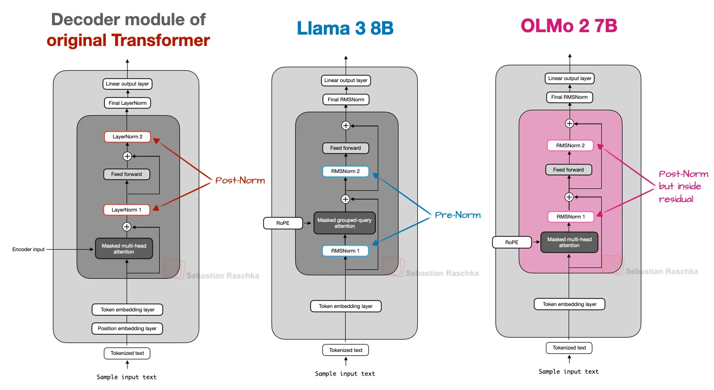

:::caption
左：Post-LN（原版 Transformer）；中：Pre-LN（GPT-2 以来的主流）；右：OLMo 2 的 Post-Norm，Norm 回到子层之后但留在残差分支里。
:::

2026 年的表格里，Nemotron 3 系列延续了 Post-Norm 路线，Gemma 4 和 Trinity 走的是"两头都放"的 Sandwich 路线，其余主流模型仍然是标准 Pre-Norm。三种流派并存，说明这个问题没有定论——大家只是各自找到了能训稳自己模型的配置。

### Sandwich Norm：两头都包

Gemma 系列从 Gemma 2 开始就在注意力模块前后各放一个 RMSNorm。这个结构便宜（RMSNorm 的开销可以忽略），图个安心。

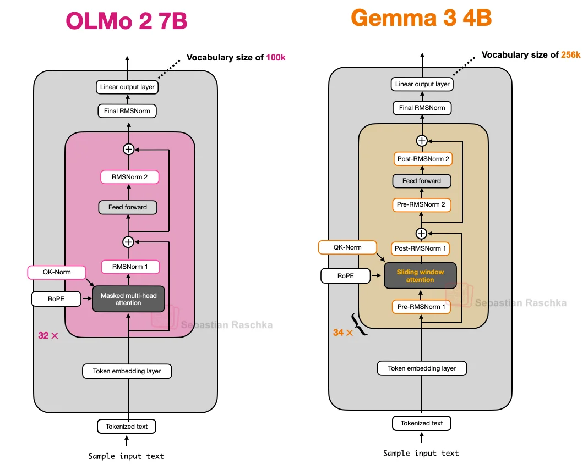

:::caption
Gemma 3/4 的三明治结构：Pre 和 Post 各一个 RMSNorm，注意力内部再加 QK-Norm。
:::

Trinity Large 在此基础上玩了个新花样：depth-scaled sandwich norm，后置 RMSNorm 的增益按 1/√L 初始化（L 是总层数）。训练早期残差更新小，随着训练推进逐渐放大。这是我在主流模型里第一次见到这种初始化技巧，他们的[技术报告](https://github.com/arcee-ai/trinity-large-tech-report)里说这样能缓解 attention sink、稳住长序列训练。

### QK-Norm：压住注意力的 logits

QK-Norm 就是在 Q 和 K 进 RoPE 之前各加一个 RMSNorm，防止注意力 logits 爆掉。思路来自 2023 年的 [Scaling Vision Transformers](https://arxiv.org/abs/2302.05442)，OLMo 2、Gemma 2/3/4、Sarvam 30B 都在用。

MiniMax M2 系列做了一个变体：per-layer QK-Norm。普通 QK-Norm 的缩放参数跨注意力头共享，MiniMax 给每个头独立的 RMSNorm 参数。代码可见 [vLLM 的实现](https://github.com/vllm-project/vllm/blob/main/vllm/model_executor/models/minimax_m2.py)。

### KV-LayerNorm：Sarvam 的私有配方

Sarvam 105B 在 KV 侧加了 LayerNorm 配合 MLA 使用，这是表格里唯一一例。官方没给太细的消融，[Raschka 的架构画廊](https://sebastianraschka.com/llm-architecture-gallery/)把它标注为 "MLA with KV LayerNorm and NoPE + RoPE"。属于小众但值得记录的设计。

## 位置编码：RoPE 一统天下，然后开始做减法

[RoPE](https://arxiv.org/abs/2104.09864)（旋转位置编码）已经是绝对主流，2026 年的看点是谁在 RoPE 上做减法。

**Partial RoPE（p-RoPE）**：只给一部分维度做旋转。MiniMax 系列只旋转一半的 head 维度，官方说法是这样能做长度外推而不掉点（[MiniMax-01 技术报告](https://arxiv.org/abs/2501.08313)）；Gemma 4 更激进，只给 25% 的频率对加位置信息，理由是减少长上下文下的位置噪声。

**NoPE（无位置编码）**：[2023 年的论文](https://arxiv.org/abs/2305.19466)发现因果掩码本身已经隐含了位置信息，完全可以不加显式位置编码，而且长度外推反而更好。

**RoPE+NoPE 混合**成了 2026 年的一个流行配方：滑动窗口层用 RoPE，全局注意力层用 NoPE。Trinity Large、Tiny Aya 都是这个做法（Kimi Linear 的 MLA 全局层也是 NoPE，作者说这让 MLA 在推理时能按 MQA 跑，还省掉了长上下文的 RoPE 重调）。位置编码从"必须精心设计"变成了"可以按层裁剪的组件"。

## 注意力：真正的战场

这一列信息量最大。把 27 个模型的 Attention 列归拢一下，大概是四条路线。

### 路线一：GQA + 滑动窗口，性价比组合

GQA（分组查询注意力，[arXiv:2305.13245](https://arxiv.org/abs/2305.13245)）让多个 Query 头共享一组 KV 头，KV cache 直接按比例缩小，效果几乎不掉，从 Llama 2/3 时代就是标配。

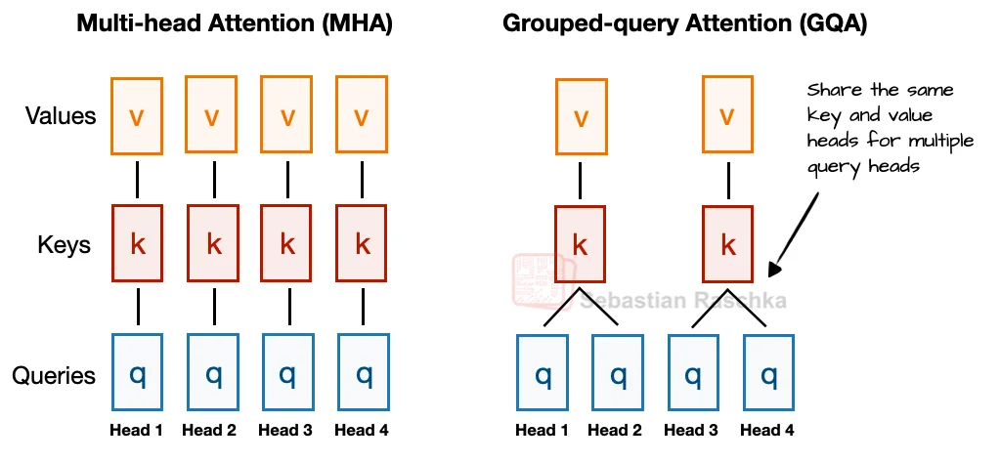

:::caption
MHA（左）每个头独立 KV；GQA（右）分组共享，图中 4 个 Query 头共享 2 组 KV。
:::

滑动窗口注意力（SWA）更狠：每个 token 只看附近固定窗口，KV cache 与序列长度解耦。思想来自 [Longformer](https://arxiv.org/abs/2004.05150)，Gemma 3 把它推成主流配方——5 层 SWA 配 1 层全局注意力，窗口 1024。Gemma 4 延续 5:1 比例，还把全局层的 value 直接复用 key（v=k）进一步砍 cache。

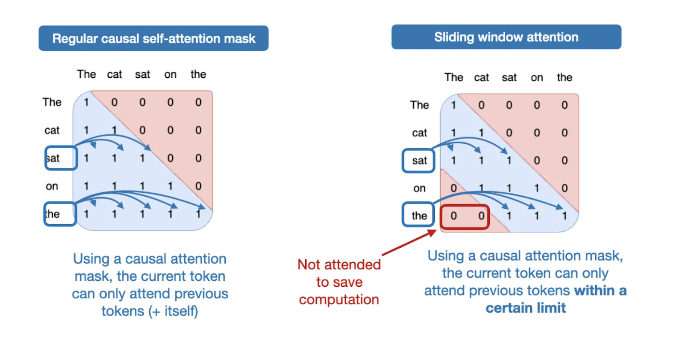

:::caption
左边全局注意力，每个 token 能看全序列；右边 SWA 只看窗口内。Gemma 3 的消融显示对困惑度影响极小。
:::

2026 年这条路线的玩家：Gemma 4（5:1，窗口 1024）、Step 3.5 Flash（3:1，窗口 512）、Trinity（3:1，窗口 4096）、Tiny Aya（3:1）、MiMo-V2.5（5:1，窗口 128——目前已知最激进的窗口，配 1M 上下文用）。Step 3.5 Flash 的[论文](https://arxiv.org/abs/2602.10604)专门解释了为什么选 SWA 而不是线性注意力：SWA 与 MTP投机解码兼容得好，且窗口固定后多加 Query 头（64→96）不增加长上下文开销。

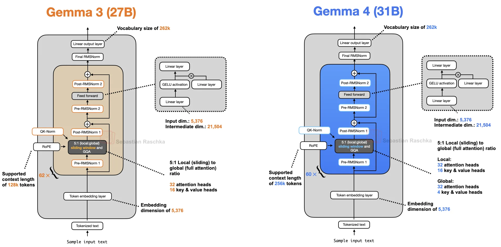

:::caption
Gemma 4（右）和 Gemma 3（左）放在一起几乎看不出区别，最大的变化藏在全局层里：value 直接复用 key，外加 p-RoPE。
:::

### 路线二：MLA，DeepSeek 系的压缩哲学

MLA（多头潜在注意力）是 DeepSeek-V2 引入的（[arXiv:2405.04434](https://arxiv.org/abs/2405.04434)）：把 KV 压缩到一个低维 latent 向量存进 cache，用的时候再投影回去。GQA 是"少存几份 KV"，MLA 是"存压缩版 KV"，压缩比更狠（DeepSeek-V2 的 latent 是 576 维）。DeepSeek-V2 论文的消融显示 MLA 效果还略好于 MHA，这是它敢替换 GQA 的底气。

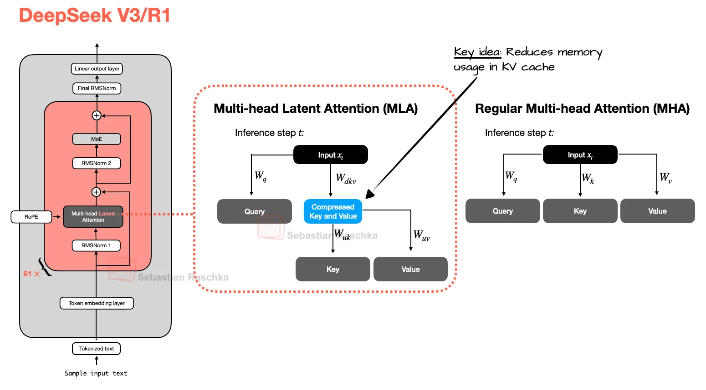

:::caption
MLA 把 KV 压缩到低维 latent 存储，推理时上采样还原，KV cache 显著缩小。
:::

2026 年 MLA 已经走出了 DeepSeek：Kimi K2.5/K2.6、GLM-5/5.1、Ling 2.5/2.6、Mistral Small 4、Sarvam 105B 都在用。GLM-5 的技术报告里有个细节值得一看：他们发现 Muon 优化器下 576 维 latent 的 MLA 打不过 GQA-8，于是把 head dim 从 192 提到 256、头数减 1/3（他们叫 MLA-256）才追平——MLA 不是免检的，超参数要跟着训练配方一起调。

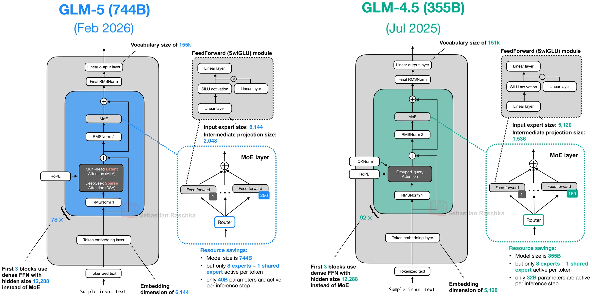

:::caption
GLM-5（右）相比 GLM-4.5（左）：换上 MLA + DSA，专家从 160 个加到 256 个，层数反而从 92 减到 78。
:::

### 路线三：稀疏注意力，服务超长上下文

GQA/MLA 省的是 KV cache 显存，但注意力的计算量还是 O(n²)。要做百万级上下文，得让每个 token 别看全部历史。

**DSA（DeepSeek Sparse Attention）**：V3.2 引入（[arXiv:2512.02556](https://arxiv.org/abs/2512.02556)）。一个轻量的 lightning indexer 给每个 token 打分，选出少量相关 token 做精细注意力，其余粗略处理。V3.2 之后，GLM-5 直接在继续预训练阶段接入 DSA（他们的消融显示长上下文基准上 DSA 版优于 MLA-only 版），Kimi 的 K2.5 沿用 MLA 不动。

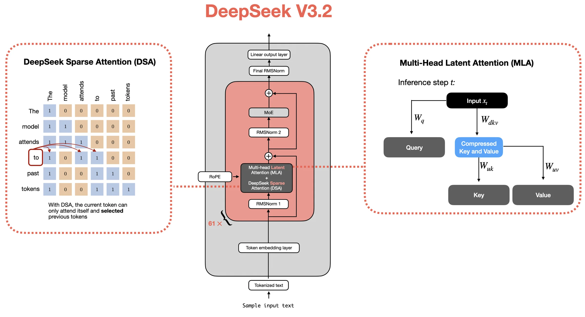

:::caption
V3.2 架构：MLA 基础上加 DSA 稀疏化，V4 的 CSA/HCA 是这条路线的进一步压缩。
:::

**CSA/HCA**：V4（[arXiv:2606.19348](https://arxiv.org/abs/2606.19348)）把稀疏化再推一步，CSA（压缩稀疏注意力）和 HCA（重度压缩注意力）逐层交替。官方数字：1M token 场景下单 token 推理 FLOPs 只有 V3.2 的 27%，KV cache 只有 10%。这是"注意力不再把历史当作扁平 token 列表"这个思路的极致版本。

### 路线四：线性注意力回归，混合架构当道

线性注意力（O(n) 复杂度）在 2020 年前后火过一阵，因为掉点严重被雪藏。2025 年下半年开始翻红，Raschka 画的时间线很直观：

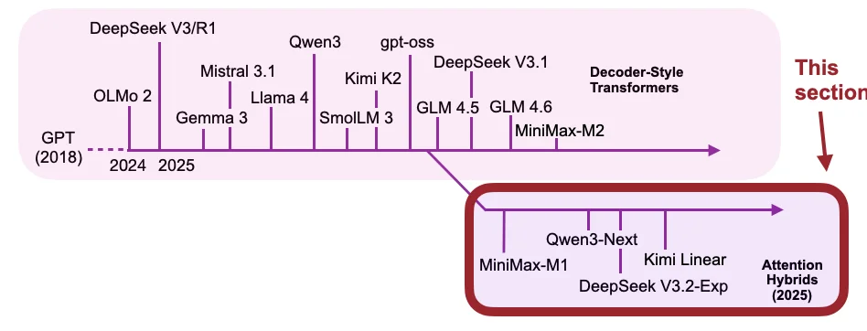

:::caption
2025 下半年起，MiniMax-M1、Qwen3-Next、DeepSeek V3.2、Kimi Linear 相继转向高效注意力混合。
:::

**Gated DeltaNet**：Qwen3.5/3.6 的选择。DeltaNet 用 delta rule 增量更新一个固定大小的记忆矩阵（可以理解为可学习的快速权重 RNN），Gated 版本加上 Mamba 式的门控衰减（[arXiv:2412.06464](https://arxiv.org/abs/2412.06464)）。纯线性注意力检索精度不够，所以 Qwen 用 3:1 的比例穿插全注意力层——3 层 Gated DeltaNet 配 1 层 Gated Attention。

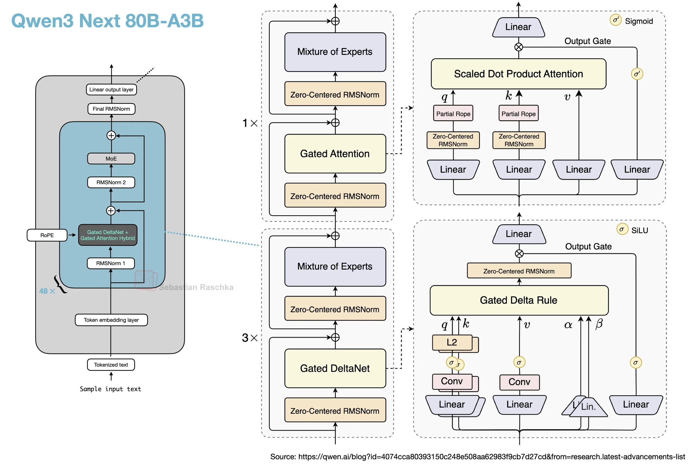

:::caption
3 层 Gated DeltaNet + 1 层 Gated Attention 为一组循环堆叠。Gated Attention 就是普通注意力加输出门。
:::

**Lightning Attention**：MiniMax-01 引入（[arXiv:2501.08313](https://arxiv.org/abs/2501.08313)），Ant Group 的 Ling 系列接棒。Ling 2.6 用 MLA + Lightning Attention 7:1 混合，官方说这是从 GQA 架构平滑迁移过来的（[HF 模型卡](https://huggingface.co/inclusionAI/Ling-2.6-1T-base)里有迁移流程）。有意思的是 MiniMax 自己在 M2 上放弃了线性注意力回到全注意力——官方理由是线性注意力在推理和多轮对话任务上精度不佳——结果 Ling 和 Kimi 又证明配比得当就能用。这条路线的争议还没完。

**Mamba-2**：NVIDIA Nemotron 3 的选择（[arXiv:2405.21060](https://arxiv.org/abs/2405.21060)）。比 Qwen 更激进，绝大多数层都是 Mamba-2（固定大小的状态，常数开销），只留少量 GQA 层当"锚"维持全局检索。Nano 4B 是端侧模型，Super 120B 支持 1M 上下文。

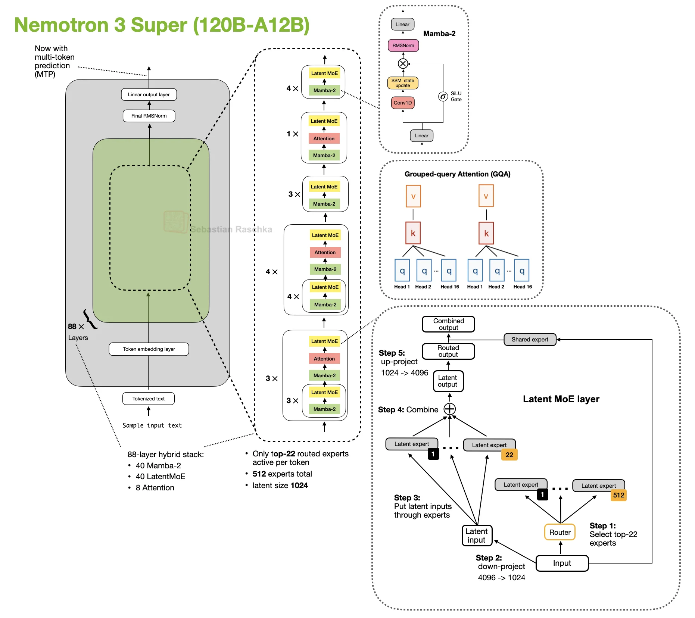

:::caption
Nemotron 3 Super：Mamba-2 层承载大部分序列建模，稀疏的注意力层做全局锚点，外加 LatentMoE 和 MTP。
:::

Kimi Linear 是这条路线的集大成者：KDA（Kimi Delta Attention，把 Gated DeltaNet 的标量门控细化到每个通道）配 gated MLA，3:1 混合。论文：[arXiv:2510.26692](https://arxiv.org/abs/2510.26692)。表格里没有 Kimi Linear（它不在截图范围内），但理解 Qwen3.5 的 DeltaNet 时值得对照着看。

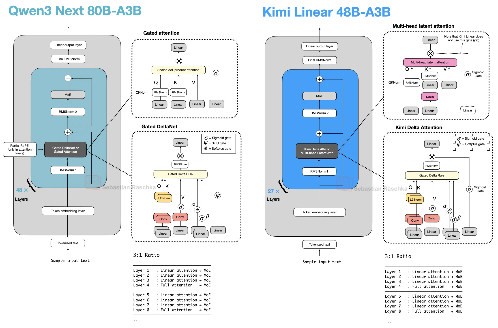

:::caption
同为 3:1 混合，Kimi Linear 把线性层换成 KDA、全注意力层换成 gated MLA，并在 MLA 层用 NoPE。
:::

**Gated Attention** 顺带说一句：它不是独立路线，而是贴在全注意力上的小补丁——输出加一个 sigmoid 门再进残差，来源是 [arXiv:2505.06708](https://arxiv.org/abs/2505.06708)。作用是消除 attention sink、稳住 massive activation。Qwen 系和 Step 3.5 Flash（head-wise 门控）在用，Trinity 也用了类似门控。

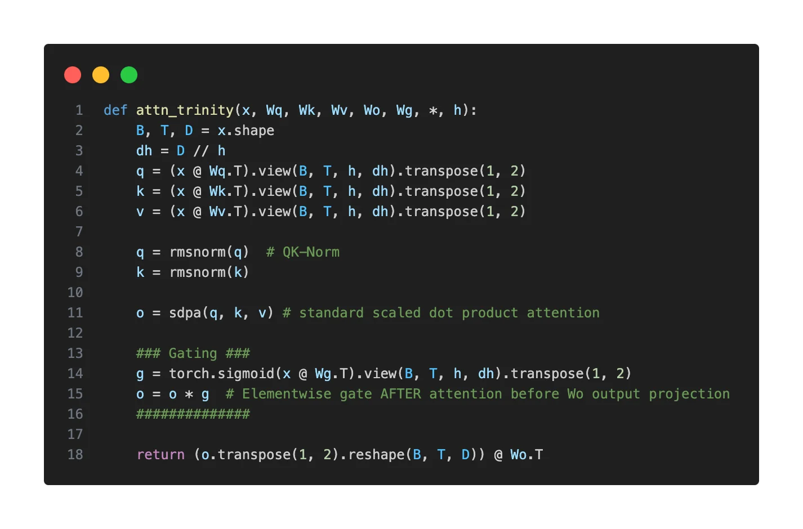

:::caption
Trinity Large 的门控：在缩放点积之后、输出投影之前加逐元素门。
:::

## FFN：MoE 的细粒度化

表格里 Sparse 的 20 个模型全走 MoE 路线，而 MoE 的当代形态基本由 DeepSeekMoE 定义（[arXiv:2401.06066](https://arxiv.org/abs/2401.06066)）：把大专家拆成更多小专家（细粒度），再加一个每个 token 必过的共享专家。小专家提升组合表达的灵活性，共享专家承接通用知识，避免每个路由专家都去学一遍常见模式。

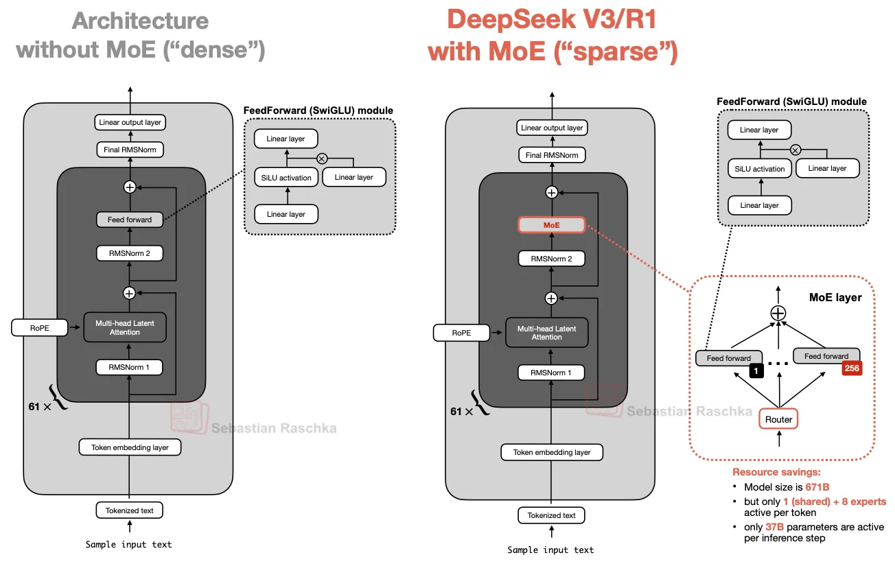

:::caption
MoE 把单个 FFN 换成 N 个专家 FFN + 路由器，每个 token 只激活其中少数几个。
:::

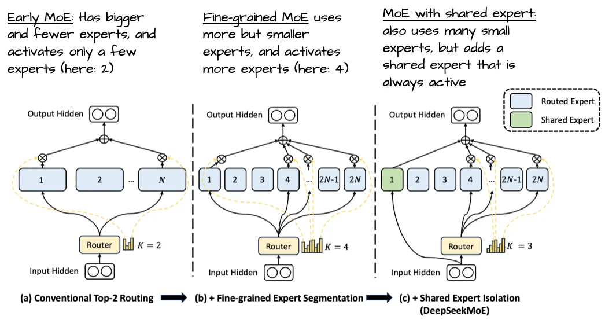

:::caption
上：传统 MoE，少量大专家；下：DeepSeekMoE，更多小专家加一个共享专家（Always-on）。
:::

这个趋势在 2026 年的数字里看得很清楚：GLM-5 每层 256 个专家（8 路由 + 1 共享），Step 3.5 Flash 288 个（top-8），Nemotron 3 Super 干脆上到 512 个（top-22）。也有逆行的：gpt-oss 只有 32 个大专家，Mistral 3 从 DeepSeek 拿来架构后故意把专家做粗来换取推理吞吐。专家数量不是越多越好，是和部署形态绑定的取舍。

另一个细节：几乎所有 MoE 模型的开头都刻意绕开常规路由。GLM-5、Step 3.5 Flash 的前 3 层是纯稠密 FFN；DeepSeek V4 更有意思，前 3 层用 token id 哈希直接路由的 MoE，连学习出来的路由器都省了。道理是相通的：早期层负责稳定的底层特征，这时候引入路由的不稳定性得不偿失。

## 残差：25 家 RC，2 家 mHC

表格里最扎眼的差异在残差列。25 个模型用最普通的残差连接（RC），DeepSeek V4 系列换成了 mHC（流形约束超连接）。

故事从 [Hyper-Connections](https://arxiv.org/abs/2409.19606)（字节，2024）开始：把单一的残差流加宽成 n 路，层与层之间的连接模式变成可学习的混合矩阵，表达力更强。但 HC 的混合矩阵是自由参数，破坏了残差连接的恒等映射性质，深了之后训练发散。

DeepSeek 的 [mHC](https://arxiv.org/abs/2512.24880)（2025 年 12 月论文）给混合矩阵加了个流形约束：用 Sinkhorn-Knopp 算法迭代约 20 轮，把它投影到双随机矩阵空间（Birkhoff 多面体），恒等映射性质回来了，训练稳了。V4 是 mHC 的第一个前沿规模部署，配置里 `hc_mult: 4`（4 路残差流）、`hc_sinkhorn_iters: 20`。论文也坦承新加的稳定机制是经验性发现，没有理论保证——工程先跑通，理论以后补。

## 激活函数：SwiGLU 的天下，Gemma 的坚持

这一列几乎不需要讨论：SiLU 门控的 SwiGLU 是绝对主流，2026 年唯一还在用 GELU 系（GeGLU）的只有 Gemma 4，从 Gemma 一代传下来的家族传统。效果上两者没有公认的显著差距，属于"没有理由换就没有换"的存量选择。

## 把表格合上看：三条路线

把 27 行数据放在一起，2026 年的开源模型界大致分成了三个阵营：

**DeepSeek 系（压缩注意力）**：MLA 打底，V3.2 之后叠 DSA/CSA/HCA 做稀疏化，目标是用最小的 KV cache 和计算量扛起百万上下文。用户：GLM-5/5.1、Kimi K2.5/K2.6、Mistral Small 4、Sarvam 105B、Ling 系列（Ling 用 MLA 但配的是 Lightning），以及 DeepSeek V4-Flash（V4-Pro 的逐层配置见上面脚注）。

**Qwen 系（线性混合）**：Gated DeltaNet 与 Gated Attention 按 3:1 混合，赌的是线性注意力终于能扛主力的时刻到了。用户：Qwen3.5/3.6 全系（连 27B dense 版都换了）。

**Google 系（经典打磨）**：GQA + 5:1 SWA + sandwich norm，架构上最保守，靠数据和训练把 31B 稠密模型打出了 397B MoE 的排名（Raschka 引用的 AI Arena 榜单）。另外 Nemotron 的 Mamba 混合、Nanbeige 的全经典配置，说明"不折腾也能活"这条路还在。

回头看那张截图的配文——"这些组合也全都被玩完了"——话糙理不糙。Pre-Norm 还是 Post-Norm、MLA 还是 GQA、全注意力还是线性混合，每个位置都有两三个成熟选项，新模型的发布越来越像在菜单里点菜。但反过来想，组合的收敛恰恰说明基础架构不再是瓶颈，2026 年各家真正拉开差距的地方在数据、训练配方和后训练上。架构同质化的下一站是什么？DeepSeek V4 的 mHC 也许是个信号：当纵向的深度和宽度都卷完了，横着加宽残差流成了新的扩展维度。

## 参考

汇总用的主要来源：

- Sebastian Raschka, [The Big LLM Architecture Comparison](https://magazine.sebastianraschka.com/p/the-big-llm-architecture-comparison)（2025-07 发布，2026-04 更新至 Gemma 4）
- Sebastian Raschka, [A Dream of Spring for Open-Weight LLMs](https://magazine.sebastianraschka.com/p/a-dream-of-spring-for-open-weight)（2026 年 1-2 月十个架构的补充）
- [Raschka 的 LLM Architecture Gallery](https://sebastianraschka.com/llm-architecture-gallery/)（逐模型架构卡片与 config 对照）

论文（按文中出现顺序）：

| 技术                              | 论文                                                                              |
| --------------------------------- | --------------------------------------------------------------------------------- |
| Transformer / MHA                 | [Attention Is All You Need](https://arxiv.org/abs/1706.03762)                     |
| GQA                               | [arXiv:2305.13245](https://arxiv.org/abs/2305.13245)                              |
| MLA                               | [DeepSeek-V2, arXiv:2405.04434](https://arxiv.org/abs/2405.04434)                 |
| DeepSeekMoE                       | [arXiv:2401.06066](https://arxiv.org/abs/2401.06066)                              |
| Pre-LN / Post-LN                  | [Xiong et al., arXiv:2002.04745](https://arxiv.org/abs/2002.04745)                |
| OLMo 2（Post-Norm 实践）          | [arXiv:2501.00656](https://arxiv.org/abs/2501.00656)                              |
| QK-Norm 来源                      | [Scaling Vision Transformers, arXiv:2302.05442](https://arxiv.org/abs/2302.05442) |
| RMSNorm                           | [arXiv:1910.07467](https://arxiv.org/abs/1910.07467)                              |
| RoPE                              | [RoFormer, arXiv:2104.09864](https://arxiv.org/abs/2104.09864)                    |
| NoPE                              | [arXiv:2305.19466](https://arxiv.org/abs/2305.19466)                              |
| YaRN（长度扩展）                  | [arXiv:2309.00071](https://arxiv.org/abs/2309.00071)                              |
| SWA（长文窗口）                   | [Longformer, arXiv:2004.05150](https://arxiv.org/abs/2004.05150)                  |
| Gemma 3（5:1 SWA 实践）           | [arXiv:2503.19786](https://arxiv.org/abs/2503.19786)                              |
| Gated Attention                   | [arXiv:2505.06708](https://arxiv.org/abs/2505.06708)                              |
| Gated DeltaNet                    | [arXiv:2412.06464](https://arxiv.org/abs/2412.06464)                              |
| Mamba-2                           | [arXiv:2405.21060](https://arxiv.org/abs/2405.21060)                              |
| Kimi Linear / KDA                 | [arXiv:2510.26692](https://arxiv.org/abs/2510.26692)                              |
| MiniMax-01（Lightning Attention） | [arXiv:2501.08313](https://arxiv.org/abs/2501.08313)                              |
| DeepSeek-V3（基线架构）           | [arXiv:2412.19437](https://arxiv.org/abs/2412.19437)                              |
| DeepSeek-V3.2 / DSA               | [arXiv:2512.02556](https://arxiv.org/abs/2512.02556)                              |
| DeepSeek-V4 / CSA-HCA             | [arXiv:2606.19348](https://arxiv.org/abs/2606.19348)                              |
| Hyper-Connections                 | [arXiv:2409.19606](https://arxiv.org/abs/2409.19606)                              |
| mHC                               | [arXiv:2512.24880](https://arxiv.org/abs/2512.24880)                              |
| MTP                               | [arXiv:2404.19737](https://arxiv.org/abs/2404.19737)                              |
| GLM-5                             | [arXiv:2602.15763](https://arxiv.org/abs/2602.15763)                              |
| Kimi K2.5                         | [arXiv:2602.02276](https://arxiv.org/abs/2602.02276)                              |
| Step 3.5 Flash                    | [arXiv:2602.10604](https://arxiv.org/abs/2602.10604)                              |
| MiniMax-M2 系列                   | [arXiv:2605.26494](https://arxiv.org/abs/2605.26494)                              |
| Nemotron 3 Super                  | [arXiv:2604.12374](https://arxiv.org/abs/2604.12374)                              |
| Nemotron 3 Nano                   | [arXiv:2512.20848](https://arxiv.org/abs/2512.20848)                              |
