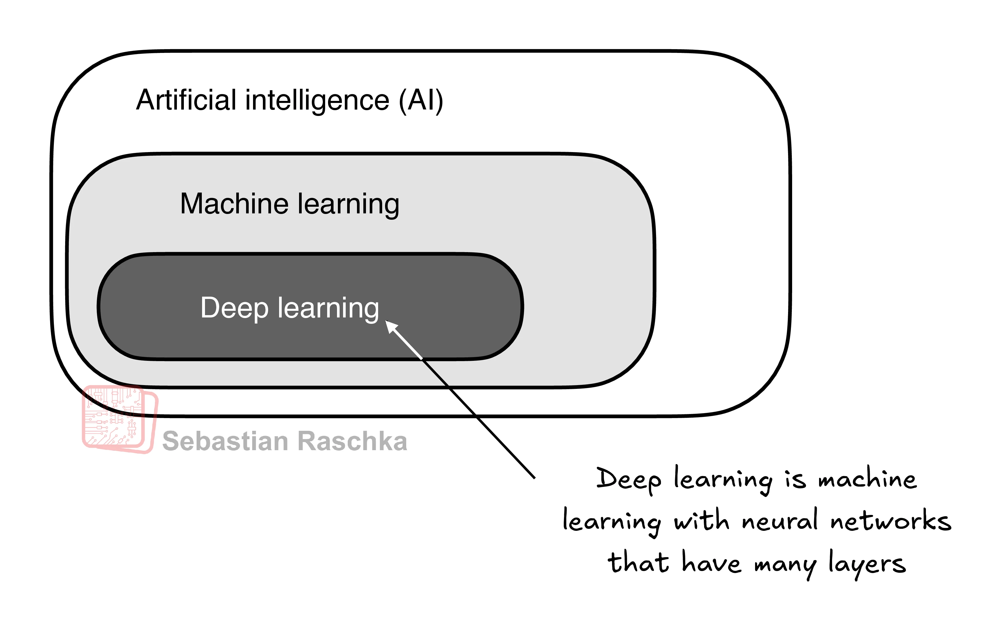
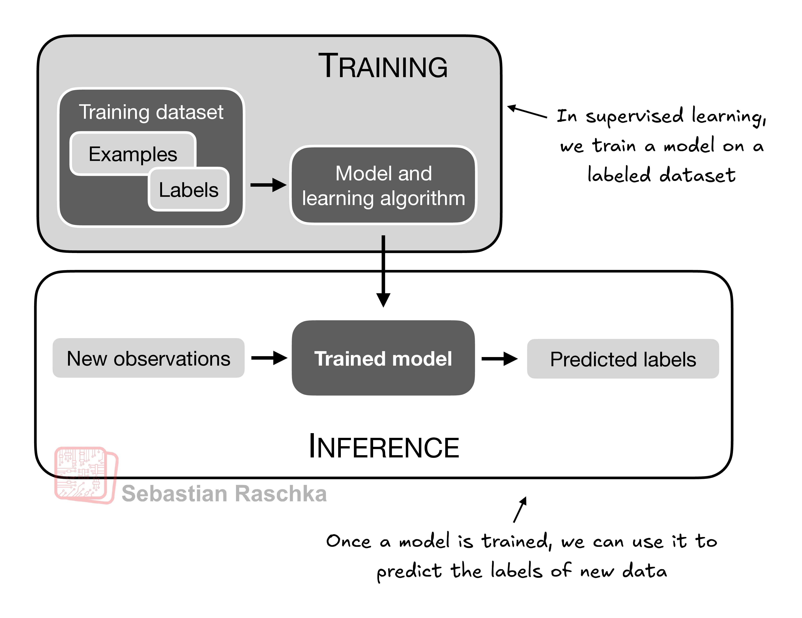
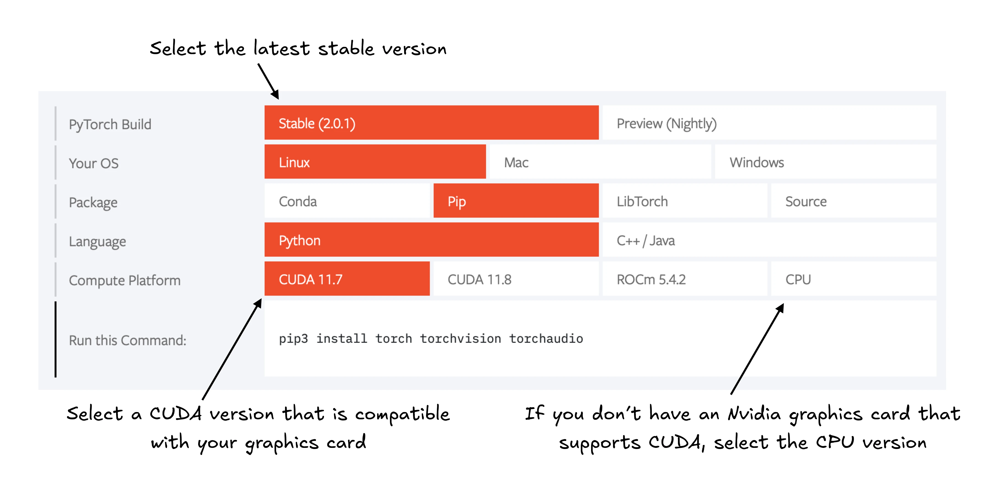
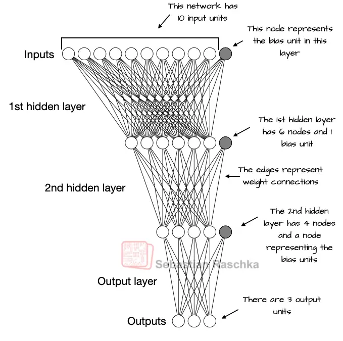
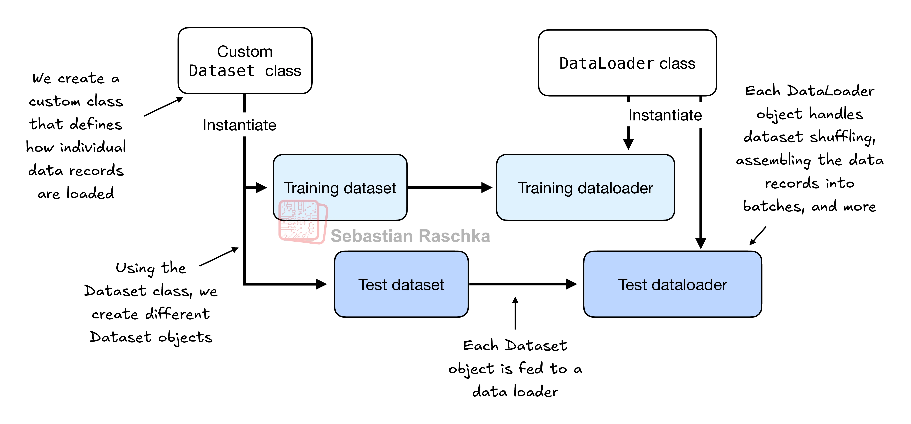
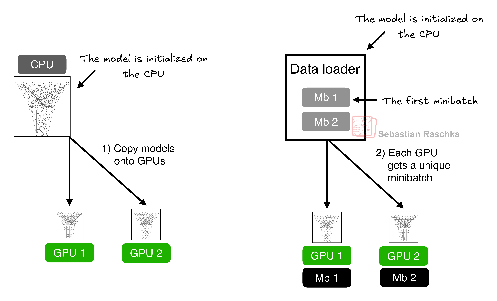
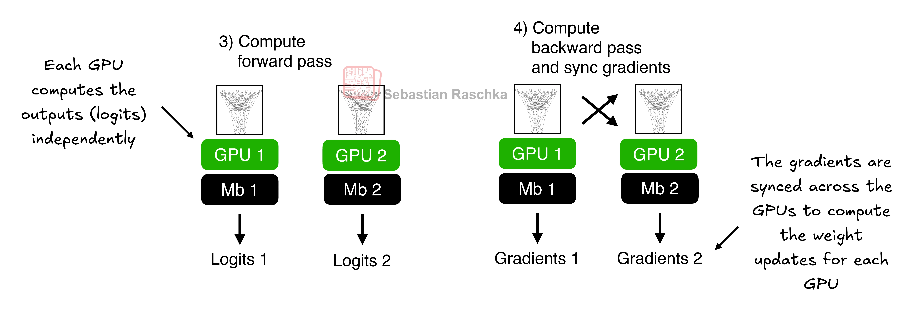

> 原文：[PyTorch in One Hour: From Tensors to Training Neural Networks on Multiple GPUs](https://sebastianraschka.com/teaching/pytorch-1h/)（Sebastian Raschka，2025-07-01）。

本教程旨在用大约一小时的阅读时间，向你介绍广受欢迎的开源深度学习库 PyTorch 最核心的主题。我的主要目标是让你快速掌握这些要点，从而能够开始使用并实现深度神经网络，例如大型语言模型（LLM）。

本教程涵盖以下主题：

- PyTorch 深度学习库概览
- 为深度学习配置环境和工作区
- 张量——深度学习的基础数据结构
- 深度神经网络训练的机制
- 在 GPU 上训练模型

你将学习张量这一核心概念及其在 PyTorch 中的用法。我们还会介绍 PyTorch 的自动微分引擎：它让我们能够便捷而高效地使用反向传播——神经网络训练中至关重要的一环。

请注意，本教程面向刚接触 PyTorch 深度学习的读者。虽然本章会从零开始讲解 PyTorch，但它并不打算穷尽 PyTorch 库的方方面面。相反，本章聚焦于那些对实现 LLM 等任务真正有用的 PyTorch 基础。

我使用、构建并讲授 PyTorch 已将近十年。在这篇教程里，我尝试提炼出我认为最核心的概念：你上手所需的一切，仅此而已——因为你的时间宝贵，而你肯定想尽快开始动手构建！

## 1. 什么是 PyTorch

[_PyTorch_](https://pytorch.org/) 是一个基于 Python 的开源深度学习库。根据追踪和分析研究论文的平台 [_Papers With Code_](https://paperswithcode.com/trends) ，自 2019 年以来，PyTorch 一直以明显优势成为研究领域使用最广泛的深度学习库。而根据 [_Kaggle Data Science and Machine Learning Survey 2022_](https://www.kaggle.com/c/kaggle-survey-2022) ，使用 PyTorch 的受访者约占 40%，并且这一比例每年都在持续增长。

PyTorch 如此受欢迎的原因之一，是它用户友好的界面与高效的性能。不过，尽管易于上手，它并不牺牲灵活性：高级用户仍然可以调整模型底层的细节，进行定制与优化。简而言之，对许多实践者和研究者来说，PyTorch 在易用性与功能之间提供了恰到好处的平衡。

在接下来的小节中，我们将介绍 PyTorch 提供的主要特性。

### 1.1 PyTorch 的三个核心组成部分

PyTorch 是一个相对全面的库，一种理解它的方式是聚焦于它的三个主要组成部分，图 1 对此做了总结。


:::caption
图 1：PyTorch 的三个主要组成部分包括：作为计算基础构件的张量库、用于模型优化的自动微分，以及让深度神经网络更易实现和训练的深度学习工具函数。
:::

首先，PyTorch 是一个*张量库*：它在面向数组编程的库 NumPy 的基础上，扩展了在 GPU 上加速计算的能力，从而可以在 CPU 与 GPU 之间无缝切换。

其次，PyTorch 是一个*自动微分引擎*，也被称为 autograd，它能够自动计算张量运算的梯度，从而简化反向传播与模型优化。

最后，PyTorch 是一个*深度学习库*，也就是说，它提供模块化、灵活且高效的构件（包括预训练模型、损失函数和优化器），用于设计和训练各种深度学习模型，同时满足研究者和开发者的需求。

在接下来的两个小节中定义完深度学习的概念并安装好 PyTorch 之后，本教程的其余部分将结合动手代码示例，更详细地讲解 PyTorch 的这三个核心组成部分。

### 1.2 什么是深度学习

在新闻里，LLM 常被称为 _AI_ 模型。然而，LLM 也是一种深度神经网络，而 PyTorch 是一个深度学习库。听起来有点混乱？在继续之前，让我们花一点时间厘清这些术语之间的关系。

AI 从根本上说，是创造能够执行通常需要人类智能的任务的计算机系统。这些任务包括理解自然语言、识别模式以及做出决策。（尽管已经取得了长足进步，AI 距离达到这种水平的通用智能仍然很遥远。）

*机器学习*是 AI 的一个子领域（如图 2 所示），专注于开发和改进学习算法。机器学习背后的核心思想，是让计算机能够从数据中学习，并在没有被显式编程来执行任务的情况下作出预测或决策。这需要开发能够识别模式、从历史数据中学习的算法，并借助更多的数据和反馈随时间推移不断提升性能。



:::caption
图 2：深度学习是机器学习的子类，专注于深度神经网络的实现；机器学习又是 AI 的子类，关注从数据中学习的算法；AI 则是“机器能够执行通常需要人类智能的任务”这一更宽泛的概念。
:::

机器学习在 AI 的演进中一直不可或缺，驱动着我们今天看到的许多进步，包括 LLM。机器学习也支撑着许多技术，例如在线零售商和流媒体服务使用的推荐系统、电子邮件垃圾邮件过滤、虚拟助手中的语音识别，甚至自动驾驶汽车。机器学习的引入与进步显著增强了 AI 的能力，使其能够超越严格的基于规则的系统，适应新的输入或不断变化的环境。

*深度学习*是机器学习的一个子类，专注于深度神经网络的训练与应用。这些深度神经网络最初的灵感来自人脑的工作方式，尤其是大量神经元之间的相互连接。深度学习中的“深度”，指的是人工神经元或节点的多个隐藏层，这些隐藏层让网络能够建模数据中复杂的非线性关系。

与擅长简单模式识别的传统机器学习技术不同，深度学习特别擅长处理图像、音频或文本等非结构化数据，因此深度学习尤其适合 LLM。

机器学习与深度学习中典型的预测建模流程（也称为*监督学习*）总结于图 3。



:::caption
图 3：用于预测建模的监督学习流程包含训练阶段——模型在训练数据集中带标签的样本上训练；训练好的模型随后可用于预测新观测的标签。
:::

借助学习算法，模型在由样本及对应标签组成的训练数据集上进行训练。以电子邮件垃圾邮件分类器为例，训练数据集由电子邮件以及人工标注的*垃圾邮件*和*非垃圾邮件*标签组成。然后，训练好的模型可以用于新的观测（新邮件），预测它们未知的标签（*垃圾邮件*或*非垃圾邮件*）。

当然，我们还希望在训练与推理阶段之间加入模型评估，以确保模型在投入真实应用之前满足我们的性能标准。

请注意，训练和使用 LLM 的流程（例如，训练它们对文本进行分类时）与图 3 所示流程类似。如果我们感兴趣的是训练 LLM 生成文本——例如我的[《Build A Large Language Model (From Scratch)》](https://amzn.to/4fqvn0D)一书所覆盖的内容——图 3 依然适用。在这种情况下，预训练期间的标签可以从文本本身推导出来；而在推理阶段，LLM 会针对给定的输入提示生成全新的文本（而不是预测标签）。

### 1.3 安装 PyTorch

PyTorch 的安装方式与任何其他 Python 库或包相同。不过，由于 PyTorch 是一个同时支持 CPU 与 GPU 计算的综合性库，安装过程可能需要额外的说明。

> **Python 版本。**许多科学计算库不会立即支持最新版本的 Python。因此，安装 PyTorch 时，建议使用比最新版本落后一到两个发布的 Python 版本。例如，如果最新版本的 Python 是 3.13，建议使用 Python 3.11 或 3.12。

举例来说，PyTorch 有两个版本：一个仅支持 CPU 计算的精简版，以及一个同时支持 CPU 与 GPU 计算的版本。如果你的机器配有可用于深度学习的 CUDA 兼容 GPU（理想情况下是 NVIDIA T4、RTX 2080 Ti 或更新的型号），我推荐安装 GPU 版本。无论如何，在代码终端中安装 PyTorch 的默认命令如下：

```bash
pip install torch
```

假设你的计算机支持 CUDA 兼容的 GPU，那么只要你正在使用的 Python 环境装有必要的依赖（例如 pip），这条命令就会自动安装通过 CUDA 支持 GPU 加速的 PyTorch 版本。

> **用于深度学习的 AMD GPU。**在撰写本文时，PyTorch 也已通过 ROCm 为 AMD GPU 增加了实验性支持。更多说明请参阅 [https://pytorch.org](https://pytorch.org)。

不过，若要显式安装与特定 CUDA 兼容的 PyTorch 版本，通常最好明确指定你希望 PyTorch 兼容的 CUDA 版本。PyTorch 官方网站（https://pytorch.org）为不同操作系统提供了安装带 CUDA 支持的 PyTorch 的命令，如图 4 所示。



:::caption
图 4：访问 https://pytorch.org 的安装推荐页面，为你的系统定制并选择安装命令。
:::

在撰写本文时，本教程基于 PyTorch 2.4.1，因此建议使用下面的安装命令安装完全相同的版本，以保证与本教程兼容：

```bash
pip install torch==2.4.1
```

不过，如前所述，根据你的操作系统，安装命令可能与上面展示的略有不同。因此，我建议访问 [https://pytorch.org](https://pytorch.org/) 网站，使用其安装菜单（见图 4）为你的操作系统选择安装命令，并把命令中的 torch 替换为 `torch==2.4.1`。

要检查 PyTorch 的版本，可以在 PyTorch 中执行以下代码：

```python
import torch
torch.__version__
```

这会打印出：

```text
'2.4.1'
```

> **PyTorch 与 Torch。**请注意，这个 Python 库之所以命名为 “torch”，主要是因为它延续了 Torch 库，但针对 Python 进行了改编（因此得名 “PyTorch”）。“torch” 这个名字认可了该库在 Torch 中的根基——Torch 是一个广泛支持机器学习算法的科学计算框架，最初使用 Lua 编程语言创建。

安装 PyTorch 后，你可以在 Python 中运行以下代码，检查你的安装是否能识别内置的 NVIDIA GPU：

`import torch`
`torch.cuda.is_available()`

这会返回：

`True`

如果命令返回 `True`，就一切就绪。如果返回 `False`，你的计算机可能没有兼容的 GPU，或者 PyTorch 没有识别到它。虽然用 PyTorch 训练神经网络模型并不需要 GPU，但 GPU 能显著加速与深度学习相关的计算，让模型训练快几个数量级。

如果你无法使用 GPU，有几家云计算提供商提供按小时计费的 GPU 计算服务。一个流行的类 Jupyter Notebook 环境是 Google Colab（[https://colab.research.google.com](https://colab.research.google.com/)），在撰写本文时，它提供限时的 GPU 访问。通过 “Runtime” 菜单可以选择 GPU，如图 5 的截图所示。


:::caption
图 5：在 Google Colab 的 _Runtime/Change runtime type_ 菜单下为 Colab 选择 GPU 设备。
:::

> **Apple Silicon 上的 PyTorch。**如果你的 Apple Mac 配备 Apple Silicon 芯片（如 M1、M2、M3、M4 或更新的型号），你可以利用它的能力来加速 PyTorch 代码的执行。要使用 Apple Silicon 芯片运行 PyTorch，首先像平时一样安装 PyTorch。然后，要检查你的 Mac 是否支持用 Apple Silicon 芯片加速 PyTorch，可以在 Python 中运行一段简单的代码：`print(torch.backends.mps.is_available())`。如果返回 `True`，说明你的 Mac 有可用于加速 PyTorch 代码的 Apple Silicon 芯片。

## 2 理解张量

张量是一个数学概念，它将向量和矩阵推广到可能更高的维度。换句话说，张量是可以用阶（order，或 rank）来刻画的数学对象，阶给出了维度的数量。例如，标量（只是一个数字）是 0 阶张量，向量是 1 阶张量，矩阵是 2 阶张量，如图 6 所示。


:::caption
图 6：不同阶张量的示意图。这里 0D 对应 0 阶，1D 对应 1 阶，2D 对应 2 阶。注意，由 3 个元素组成的三维向量仍然是 1 阶张量。
:::

从计算的角度看，张量充当数据容器。例如，它们容纳多维数据，其中每个维度代表一个不同的特征。像 PyTorch 这样的张量库可以高效地创建、操作这些多维数组并与之进行运算。在这种语境下，张量库起到的就是数组库的作用。

PyTorch 张量与 NumPy 数组类似，但拥有若干对深度学习很重要的额外特性。例如，PyTorch 增加了自动微分引擎，简化了*梯度计算*，我们将在后面的第 4 节讨论。PyTorch 张量还支持 GPU 计算，以加速深度神经网络的训练，我们将在后面的第 9.1 节讨论。

> **PyTorch 拥有类似 NumPy 的 API。**在接下来的小节中你会看到，PyTorch 在其张量运算中采用了大部分 NumPy 数组 API 和语法。如果你不熟悉 NumPy，可以通过我的文章《Scientific Computing in Python: Introduction to NumPy and Matplotlib》快速了解最相关的概念，见 https://sebastianraschka.com/blog/2020/numpy-intro.html。

接下来的小节将介绍 PyTorch 张量库的基本操作，展示如何创建简单的张量，并讲解一些基本运算。

### 2.1 标量、向量、矩阵与张量

如前所述，PyTorch 张量是数组类结构的数据容器。标量是 0 维张量（例如，只是一个数字），向量是 1 维张量，矩阵是 2 维张量。对于更高维的张量没有专门的术语，所以我们通常把 3 维张量直接称为 3D 张量，依此类推。

我们可以使用 `torch.tensor` 函数创建 PyTorch `Tensor` 类的对象，如下所示：

```python
import torch

# create a 0D tensor (scalar) from a Python integer
tensor0d = torch.tensor(1)

# create a 1D tensor (vector) from a Python list
tensor1d = torch.tensor([1, 2, 3])

# create a 2D tensor from a nested Python list
tensor2d = torch.tensor([[1, 2], [3, 4]])

# create a 3D tensor from a nested Python list
tensor3d = torch.tensor([[[1, 2], [3, 4]], [[5, 6], [7, 8]]])
```

### 2.2 张量数据类型

在上一节中，我们用 Python 整数创建了张量。在这种情况下，PyTorch 采用 Python 默认的 64 位整数数据类型。我们可以通过张量的 `.dtype` 属性访问张量的数据类型：

```python
tensor1d = torch.tensor([1, 2, 3])
print(tensor1d.dtype)
```

这会打印出：

```text
torch.int64
```

如果我们用 Python 浮点数创建张量，PyTorch 默认会创建 32 位精度的张量，如下所示：

```python
floatvec = torch.tensor([1.0, 2.0, 3.0])
print(floatvec.dtype)
```

输出为：

```text
torch.float32
```

这一选择主要是出于精度与计算效率之间的平衡。32 位浮点数对大多数深度学习任务来说精度已经足够，同时比 64 位浮点数占用更少的内存和计算资源。此外，GPU 架构针对 32 位计算进行了优化，使用这种数据类型可以显著加快模型的训练与推理。

而且，使用张量的 `.to` 方法可以随时更改精度。下面的代码演示了如何把 64 位整数张量转换为 32 位浮点张量：

```python
floatvec = tensor1d.to(torch.float32)
print(floatvec.dtype)
```

这会返回：

```text
torch.float32
```

关于 PyTorch 中各种可用张量数据类型的更多信息，我建议查阅官方文档 [https://pytorch.org/docs/stable/tensors.html](https://pytorch.org/docs/stable/tensors.html)。

### 2.3 常见 PyTorch 张量运算

完整覆盖 PyTorch 的所有张量运算和命令超出了本教程的范围。不过，我们会简要介绍那些你在几乎任何项目中都可能需要或遇到的要点。

在进入下一节、讲解计算图背后的概念之前，下面列出了最重要的 PyTorch 张量运算。

我们已经介绍过用于创建新张量的 `torch.tensor()` 函数。

```python
tensor2d = torch.tensor([[1, 2, 3],
                         [4, 5, 6]])
tensor2d
```

这会打印出：

```text
tensor([[1, 2, 3],
        [4, 5, 6]])
```

此外，`.shape` 属性让我们可以访问张量的形状：

```python
print(tensor2d.shape)
```

输出为：

```text
torch.Size([2, 3])
```

如上所示，`.shape` 返回 `[2, 3]`，表示该张量有 2 行 3 列。要把张量重塑成 3 × 2 的张量，可以使用 `.reshape` 方法：

```python
tensor2d.reshape(3, 2)
```

这会打印出：

```text
tensor([[1, 2],
        [3, 4],
        [5, 6]])
```

不过请注意，PyTorch 中更常见的重塑张量的命令是 `.view()`：

```python
tensor2d.view(3, 2)
```

输出为：

```text
tensor([[1, 2],
        [3, 4],
        [5, 6]])
```

与 `.reshape` 和 `.view` 的情况类似，有些情况下 PyTorch 对同一计算提供了多种语法选择。这是因为 PyTorch 最初沿用了原始 Lua Torch 的语法约定，之后又应广大用户的要求，增加了与 NumPy 更相似的语法。

接下来，我们可以使用 `.T` 转置张量，也就是沿对角线翻转张量。请注意，这与重塑张量并不相同——从下面的结果可以看出：

```python
tensor2d.T
```

输出为：

```text
tensor([[1, 4],
        [2, 5],
        [3, 6]])
```

最后，在 PyTorch 中两个矩阵相乘的常用方法是 `.matmul` 方法：

```python
tensor2d.matmul(tensor2d.T)
```

输出为：

```text
tensor([[14, 32],
        [32, 77]])
```

不过，我们也可以采用 `@` 运算符，它能更紧凑地完成同样的事情：

```python
tensor2d @ tensor2d.T
```

这会打印出：

```text
tensor([[14, 32],
        [32, 77]])
```

想浏览 PyTorch 中所有可用张量运算的读者（提示：其中大多数我们用不上），我建议查阅官方文档 [https://pytorch.org/docs/stable/tensors.html](https://pytorch.org/docs/stable/tensors.html)。

## 3 将模型看作计算图

在上一节中，我们介绍了 PyTorch 三大组成部分之一，即它的张量库。接下来是 PyTorch 的自动微分引擎，也就是 autograd。PyTorch 的 autograd 系统提供了在动态计算图中自动计算梯度的函数。但在下一节深入探讨梯度计算之前，我们先定义计算图的概念。

计算图是一个有向图，它让我们能够表达并可视化数学表达式。在深度学习的语境下，计算图列出了计算神经网络输出所需的计算顺序——之后我们需要它来计算反向传播所需的梯度，而反向传播是神经网络的主要训练算法。

我们来看一个具体例子，说明计算图的概念。下面的代码实现了一个简单逻辑回归分类器的前向传播（预测步骤）——它可以看作一个单层神经网络，返回一个介于 0 和 1 之间的分数，在计算损失时与真实类别标签（0 或 1）比较：

```python
import torch.nn.functional as F

y = torch.tensor([1.0])  # true label
x1 = torch.tensor([1.1]) # input feature
w1 = torch.tensor([2.2]) # weight parameter
b = torch.tensor([0.0])  # bias unit

z = x1 * w1 + b          # net input
a = torch.sigmoid(z)     # activation & output

loss = F.binary_cross_entropy(a, y)
print(loss)
```

结果是：

```text
tensor(0.0852)
```

如果上面代码中的各个部分你不都能理解，别担心。这个例子的目的并不是实现逻辑回归分类器，而是演示如何把一系列计算看作一张计算图，如图 7 所示。


:::caption
图 7：逻辑回归前向传播作为计算图。输入特征 `x1` 与模型权重 `w1` 相乘，加上偏置后经激活函数 _σ_；损失则通过比较模型输出 `a` 与给定标签 `y` 来计算。
:::

事实上，PyTorch 会在后台构建这样的计算图，我们可以利用它来计算损失函数相对于模型参数（这里是 `w1` 和 `b`）的梯度，从而训练模型——这是接下来几节的主题。

## 4 让自动微分变得简单

在上一节中，我们介绍了计算图的概念。如果在 PyTorch 中执行计算，只要计算图中某个末端节点的 `requires_grad` 属性被设为 `True`，PyTorch 默认就会在内部构建这样的图。当我们想计算梯度时，这会很有用。通过流行的反向传播算法训练神经网络时需要梯度；该算法可以被看作微积分中*链式法则*在神经网络上的实现，如图 8 所示。


:::caption
图 8：在计算图中计算损失梯度最常见的方式，是从右到左应用链式法则，这也称为反向模式自动微分或反向传播。这意味着我们从输出层（或损失本身）开始，通过网络逐层反向推进到输入层。这样做的目的是计算损失相对于网络中每个参数（权重和偏置）的梯度，它告诉我们训练期间应如何更新这些参数。
:::

> **偏导数与梯度。**图 8 展示的是偏导数，它度量函数相对于其某个变量的变化速率。梯度是包含多元函数（输入不止一个变量的函数）所有偏导数的向量。如果你不熟悉或忘记了偏导数、梯度或微积分中的链式法则，别担心。从高层看，链式法则是一种在计算图中计算损失函数相对于模型参数梯度的方法。它提供了更新每个参数所需的信息，使我们能够用梯度下降等方法最小化损失函数——损失函数是衡量模型性能的代理指标。我们将在第 7 节《典型训练循环》中重新讨论这一训练循环在 PyTorch 中的计算实现。

那么，这一切与我们之前提到的 PyTorch 库的第二个组成部分——自动微分（autograd）引擎有什么关系呢？通过追踪对张量执行的每一次运算，PyTorch 的 autograd 引擎会在后台构建计算图。然后，调用 grad 函数，我们就可以计算损失相对于模型参数 `w1` 的梯度，如下所示：

```python
import torch.nn.functional as F
from torch.autograd import grad

y = torch.tensor([1.0])
x1 = torch.tensor([1.1])
w1 = torch.tensor([2.2], requires_grad=True)
b = torch.tensor([0.0], requires_grad=True)

z = x1 * w1 + b
a = torch.sigmoid(z)

loss = F.binary_cross_entropy(a, y)

grad_L_w1 = grad(loss, w1, retain_graph=True)
grad_L_b = grad(loss, b, retain_graph=True)
```

默认情况下，PyTorch 在计算出梯度后会销毁计算图以释放内存。不过，由于我们马上就要复用这张计算图，所以设置了 `retain_graph=True`，让它保留在内存中。

我们来展示损失相对于模型参数的计算结果：

```python
print(grad_L_w1)
print(grad_L_b)
```

打印出：

```text
(tensor([-0.0898]),)
(tensor([-0.0817]),)
```

上面我们一直是在“手动”使用 grad 函数，这在做实验、调试和演示概念时很有用。但在实践中，PyTorch 提供了更高级的工具来自动化这一过程。例如，我们可以对损失调用 `.backward`，PyTorch 就会计算图中所有叶子节点的梯度，并通过张量的 `.grad` 属性保存：

```python
loss.backward()

print(w1.grad)
print(b.grad)
```

输出为：

```text
tensor([-0.0898])
tensor([-0.0817])
```

如果这一节信息量很大，让你被微积分概念弄得不知所措，别担心。虽然这些微积分术语是用来解释 PyTorch 的 autograd 组件的，但你从这一节真正需要带走的只有一点：PyTorch 通过 `.backward` 方法替我们把微积分处理好了——使用 PyTorch 时，我们通常不需要手工计算任何导数或梯度。

## 5 实现多层神经网络

在前面的章节中，我们介绍了 PyTorch 的张量与 autograd 组件。这一节重点介绍 PyTorch 作为实现深度神经网络的库。

为了给出具体例子，我们聚焦于多层感知器——一种全连接神经网络，如图 9 所示。



:::caption
图 9：具有 2 个隐藏层的多层感知器示意图。每个节点代表相应层中的一个单元。为便于说明，每一层都只有极少数节点。
:::

在 PyTorch 中实现神经网络时，我们通常会继承 `torch.nn.Module` 类来定义自己的自定义网络架构。这个 `Module` 基类提供了大量功能，让构建和训练模型更容易。例如，它允许我们封装层与运算，并跟踪模型的参数。

在这个子类中，我们在 `__init__` 构造函数中定义网络层，并在 `forward` 方法中指定它们如何协同。`forward` 方法描述输入数据如何穿过网络，并组合成一张计算图。

相比之下，`backward` 方法——我们通常不需要自己实现——在训练期间用于计算损失函数相对于模型参数的梯度，我们将在第 7 节《典型训练循环》中看到。

下面的代码实现了一个经典的双隐藏层多层感知器，以演示 `Module` 类的典型用法：

```python
class NeuralNetwork(torch.nn.Module):
    def __init__(self, num_inputs, num_outputs):
        super().__init__()

        self.layers = torch.nn.Sequential(

            # 1st hidden layer
            torch.nn.Linear(num_inputs, 30),
            torch.nn.ReLU(),

            # 2nd hidden layer
            torch.nn.Linear(30, 20),
            torch.nn.ReLU(),

            # output layer
            torch.nn.Linear(20, num_outputs),
        )

    def forward(self, x):
        logits = self.layers(x)
        return logits
```

然后，我们可以按如下方式实例化一个新的神经网络对象：

```python
model = NeuralNetwork(50, 3)
```

但在使用这个新模型对象之前，先对模型调用 print 查看它的结构摘要通常很有用：

```python
print(model)
```

这会打印出：

```text
NeuralNetwork(
  (layers): Sequential(
    (0): Linear(in_features=50, out_features=30, bias=True)
    (1): ReLU()
    (2): Linear(in_features=30, out_features=20, bias=True)
    (3): ReLU()
    (4): Linear(in_features=20, out_features=3, bias=True)
  )
)
```

请注意，在实现 `NeuralNetwork` 类时，我们使用了 `Sequential` 类。使用 `Sequential` 并非必需，但当我们有一系列希望按特定顺序执行的层时（正如这里的情况），它能让我们省心不少。这样一来，在 `__init__` 构造函数中实例化 `self.layers = Sequential(...)` 之后，我们只需调用 `self.layers`，而不必在 `NeuralNetwork` 的 forward 方法中逐层调用。

接下来，让我们检查这个模型的可训练参数总数：

```python
num_params = sum(
    p.numel() for p in model.parameters() if p.requires_grad
)
print("Total number of trainable model parameters:", num_params)
```

这会打印出：

```text
Total number of trainable model parameters: 2213
```

请注意，每个 `requires_grad=True` 的参数都算作可训练参数，并会在训练期间被更新（更多内容见后面的第 7 节《典型训练循环》）。

对于上面这个带两个隐藏层的神经网络模型，这些可训练参数位于 `torch.nn.Linear` 层中。*线性*层把输入与权重矩阵相乘，再加上偏置向量。它有时也被称为*前馈*层或*全连接*层。

根据我们上面执行的 `print(model)` 调用可以看出，第一个 Linear 层位于 layers 属性的索引位置 0。我们可以按如下方式访问对应的权重参数矩阵：

```python
print(model.layers[0].weight)
```

这会打印出：

```text
Parameter containing:
tensor([[ 0.1182,  0.0606, -0.1292,  ..., -0.1126,  0.0735, -0.0597],
        [-0.0249,  0.0154, -0.0476,  ..., -0.1001, -0.1288,  0.1295],
        [ 0.0641,  0.0018, -0.0367,  ..., -0.0990, -0.0424, -0.0043],
        ...,
        [ 0.0618,  0.0867,  0.1361,  ..., -0.0254,  0.0399,  0.1006],
        [ 0.0842, -0.0512, -0.0960,  ..., -0.1091,  0.1242, -0.0428],
        [ 0.0518, -0.1390, -0.0923,  ..., -0.0954, -0.0668, -0.0037]],
       requires_grad=True)
```

由于这是一个没有完整显示的大矩阵，让我们用 `.shape` 属性显示它的维度：

```python
print(model.layers[0].weight.shape)
```

结果是：

```text
torch.Size([30, 50])
```

（类似地，你可以通过 `model.layers[0].bias` 访问偏置向量。）

上面的权重矩阵是一个 30×50 的矩阵，我们可以看到它的 `requires_grad` 被设为 `True`，这意味着其中的元素是可训练的——这是 `torch.nn.Linear` 中权重和偏置的默认设置。

请注意，如果你在自己的计算机上执行上面的代码，权重矩阵中的数字很可能与上面显示的不同。这是因为模型权重会用小的随机数初始化，而且每次实例化网络时都不一样。在深度学习中，用小随机数初始化模型权重是可取的，目的是在训练期间打破对称性——否则各个节点在反向传播期间只会执行相同的运算和更新，网络将无法学习从输入到输出的复杂映射。

不过，虽然我们希望继续用小的随机数作为各层权重的初始值，但我们仍然可以让随机数初始化变得可复现：通过 `manual_seed` 为 PyTorch 的随机数生成器设置种子即可：

```python
torch.manual_seed(123)

model = NeuralNetwork(50, 3)
print(model.layers[0].weight)
```

```text
Parameter containing:
tensor([[-0.0577,  0.0047, -0.0702,  ...,  0.0222,  0.1260,  0.0865],
        [ 0.0502,  0.0307,  0.0333,  ...,  0.0951,  0.1134, -0.0297],
        [ 0.1077, -0.1108,  0.0122,  ...,  0.0108, -0.1049, -0.1063],
        ...,
        [-0.0787,  0.1259,  0.0803,  ...,  0.1218,  0.1303, -0.1351],
        [ 0.1359,  0.0175, -0.0673,  ...,  0.0674,  0.0676,  0.1058],
        [ 0.0790,  0.1343, -0.0293,  ...,  0.0344, -0.0971, -0.0509]],
       requires_grad=True)
```

现在，在我们花了一些时间检视 `NeuralNetwork` 实例之后，简单看一下如何通过前向传播使用它：

```python
torch.manual_seed(123)

X = torch.rand((1, 50))
out = model(X)
print(out)
```

结果是：

```text
tensor([[-0.1262,  0.1080, -0.1792]], grad_fn=<AddmmBackward0>)
```

在上面的代码中，我们生成了一条随机训练样本 `X` 作为玩具输入（注意，我们的网络期望 50 维的特征向量），把它送入模型，返回三个分数。当我们调用 `model(x)` 时，它会自动执行模型的前向传播。

前向传播指的是从输入张量计算出输出张量。这需要让输入数据穿过所有的神经网络层：从输入层开始，经过隐藏层，最后到达输出层。

上面返回的三个数字分别对应三个输出节点得到的分数。注意，输出张量还包含一个 `grad_fn` 值。

这里的 `grad_fn=<AddmmBackward0>` 表示在计算图中用于计算某个变量的最后一个函数。具体来说，`grad_fn=<AddmmBackward0>` 意味着我们正在检视的张量是通过矩阵乘法与加法运算创建的。PyTorch 在反向传播计算梯度时会用到这些信息。`grad_fn=<AddmmBackward0>` 中的 `<AddmmBackward0>` 部分指明了所执行的运算。在这个例子中，它是 `Addmm` 运算。`Addmm` 表示矩阵乘法（`mm`）后跟一次加法（`Add`）。

如果我们只是使用网络而不训练或反向传播，例如训练结束后用模型做预测，那么为反向传播构建这张计算图可能是一种浪费：它执行了不必要的计算，还占用额外的内存。因此，当我们在推理（例如做预测）而非训练时使用模型，最佳实践是使用 `torch.no_grad()` 上下文管理器，如下所示。它会告诉 PyTorch 不需要跟踪梯度，从而可以显著节省内存与计算。

```python
with torch.no_grad():
    out = model(X)
print(out)
```

```text
tensor([[-0.1262,  0.1080, -0.1792]])
```

在 PyTorch 中，常见的做法是让模型返回最后一层的输出（logits），而不经过非线性激活函数。这是因为 PyTorch 常用的损失函数会把 softmax（二分类时为 sigmoid）运算与负对数似然损失结合在同一个类中。这样做的原因是数值效率与稳定性。因此，如果我们想为预测计算类成员概率，就必须显式调用 softmax 函数：

```python
with torch.no_grad():
    out = torch.softmax(model(X), dim=1)
print(out)
```

这会打印出：

```text
tensor([[0.3113, 0.3934, 0.2952]])
```

这些值现在可以解读为类成员概率，它们的和等于 1。对于这个随机输入来说，这些值大致相等——对一个随机初始化且未经训练的模型来说，这是符合预期的。

在接下来的两节中，我们将学习如何设置高效的数据加载器，并训练模型。

## 6 设置高效的数据加载器

在上一节中，我们定义了一个自定义神经网络模型。在训练这个模型之前，我们得简要谈谈如何在 PyTorch 中创建高效的数据加载器——训练模型时我们会遍历它们。PyTorch 数据加载的整体思路如图 10 所示。



:::caption
图 10：PyTorch 实现了 `Dataset` 和 `DataLoader` 两个类。`Dataset` 类用于实例化定义每条数据记录如何加载的对象；`DataLoader` 则负责处理数据如何被打乱并组装成批次。
:::

按照图 10 的示意，在本节中我们将实现一个自定义 `Dataset` 类，用它分别创建一个训练数据集和一个测试数据集，然后再用它们创建数据加载器。

我们先创建一个简单的玩具数据集：五个训练样本，每个样本有两个特征。与训练样本配套，我们还创建一个包含对应类别标签的张量：三个样本属于类别 0，两个样本属于类别 1。此外，我们还创建一个包含两个条目的测试集。创建该数据集的代码如下所示。

```python
X_train = torch.tensor([
    [-1.2, 3.1],
    [-0.9, 2.9],
    [-0.5, 2.6],
    [2.3, -1.1],
    [2.7, -1.5]
])

y_train = torch.tensor([0, 0, 0, 1, 1])
```

```python
X_test = torch.tensor([
    [-0.8, 2.8],
    [2.6, -1.6],
])

y_test = torch.tensor([0, 1])
```

**类别标签编号** PyTorch 要求类别标签从 0 开始，并且最大的类别标签值不应超过输出节点数减 1（因为 Python 索引从 0 开始计数。所以，如果类别标签是 0、1、2、3、4，神经网络的输出层就应该由 5 个节点组成）。

接下来，我们通过继承 PyTorch 的 `Dataset` 父类来创建自定义数据集类 `ToyDataset`，如下所示。

```python
from torch.utils.data import Dataset


class ToyDataset(Dataset):
    def __init__(self, X, y):
        self.features = X
        self.labels = y

    def __getitem__(self, index):
        one_x = self.features[index]
        one_y = self.labels[index]
        return one_x, one_y

    def __len__(self):
        return self.labels.shape[0]

train_ds = ToyDataset(X_train, y_train)
test_ds = ToyDataset(X_test, y_test)
```

这个自定义 `ToyDataset` 类的用途，是用它来实例化一个 PyTorch `DataLoader`。但在进入这一步之前，让我们简要介绍一下 `ToyDataset` 代码的总体结构。

在 PyTorch 中，自定义 `Dataset` 类的三个主要部分是 `__init__` 构造函数、`__getitem__` 方法和 `__len__` 方法，如上面的 `ToyDataset` 代码所示。

在 `__init__` 方法中，我们设置一些属性，供之后在 `__getitem__` 和 `__len__` 方法中访问。这些属性可以是文件路径、文件对象、数据库连接器等。由于我们创建的是驻留在内存中的张量数据集，这里只是把 `X` 和 `y` 赋给这些属性，作为我们张量对象的存放位置。

在 `__getitem__` 方法中，我们定义如何通过索引从数据集中恰好返回一个条目：即单个训练样本或测试实例对应的特征和类别标签。（数据加载器会提供这个索引，我们稍后会介绍。）

最后，`__len__` 方法包含获取数据集长度的指令。这里我们使用张量的 `.shape` 属性返回特征数组的行数。以训练数据集为例，它有 5 行，可以按如下方式验证：

```python
len(train_ds)
```

结果是 `5`。

现在，我们已经定义了一个可用于玩具数据集的 PyTorch `Dataset` 类，接下来可以使用 PyTorch 的 `DataLoader` 类从中采样，如下面的代码所示：

```python
from torch.utils.data import DataLoader

torch.manual_seed(123)

train_loader = DataLoader(
    dataset=train_ds,
    batch_size=2,
    shuffle=True,
    num_workers=0
)
```

```python
test_ds = ToyDataset(X_test, y_test)

test_loader = DataLoader(
    dataset=test_ds,
    batch_size=2,
    shuffle=False,
    num_workers=0
)
```

实例化训练数据加载器后，我们可以像下面这样遍历它。（对 `test_loader` 的遍历方式类似，为简洁起见此处省略。）

```python
for idx, (x, y) in enumerate(train_loader):
    print(f"Batch {idx+1}:", x, y)
```

结果是：

```text
Batch 1: tensor([[ 2.3000, -1.1000],
        [-0.9000,  2.9000]]) tensor([1, 0])
Batch 2: tensor([[-1.2000,  3.1000],
        [-0.5000,  2.6000]]) tensor([0, 0])
Batch 3: tensor([[ 2.7000, -1.5000]]) tensor([1])
```

根据上面的输出可以看出，`train_loader` 遍历训练数据集时恰好访问每个训练样本一次。这被称为一个训练轮次（epoch）。由于上面我们用 `torch.manual_seed(123)` 为随机数生成器设置了种子，你应该得到与上面完全相同的样本打乱顺序。不过，如果你第二次遍历数据集，会看到打乱顺序发生了变化。这是有意的，目的是防止深度神经网络在训练期间陷入重复的更新循环。

请注意，上面我们指定的 batch size 是 2，但第 3 个 batch 只包含一个样本。这是因为我们有五个训练样本，无法被 2 整除。在实践中，一个训练轮次中最后一个 batch 明显偏小，可能会干扰训练期间的收敛。为防止这种情况，建议设置 `drop_last=True`，丢弃每个轮次的最后一个 batch，如下所示：

```python
train_loader = DataLoader(
    dataset=train_ds,
    batch_size=2,
    shuffle=True,
    num_workers=0,
    drop_last=True
)
```

现在，遍历训练加载器，可以看到最后一个 batch 被省略了：

```python
for idx, (x, y) in enumerate(train_loader):
    print(f"Batch {idx+1}:", x, y)
```

结果是：

```text
Batch 1: tensor([[-1.2000,  3.1000],
        [-0.5000,  2.6000]]) tensor([0, 0])
Batch 2: tensor([[ 2.3000, -1.1000],
        [-0.9000,  2.9000]]) tensor([1, 0])
```

最后，我们来讨论 `DataLoader` 中的 `num_workers=0` 设置。这个参数在 PyTorch 的 `DataLoader` 函数中对并行化数据加载与预处理至关重要。当 `num_workers` 设为 0 时，数据加载在主进程中完成，而不是在单独的 worker 进程中。这看起来似乎没什么问题，但当我们在 GPU 上训练较大的网络时，它可能导致模型训练显著变慢。这是因为 CPU 除了要专注于处理深度学习模型之外，还必须花时间加载和预处理数据。结果，GPU 可能会在等待 CPU 完成这些任务时处于空闲状态。相比之下，当 `num_workers` 设为大于 0 的数值时，会启动多个 worker 进程并行加载数据，把主进程解放出来专注于训练模型，从而更好地利用系统资源，如图 11 所示。


:::caption
图 11：不使用多个 worker（设置 `num_workers=0`）加载数据会造成数据加载瓶颈，如左子图所示，模型在下一个批次加载完成前只能空闲等待。如果启用多个 worker，数据加载器就能如右子图所示，在后台预先排好下一个批次。
:::

不过，如果我们处理的是非常小的数据集，把 `num_workers` 设为 1 或更大可能没有必要，因为总训练时间本来也只有几分之一秒。相反，如果你在使用很小的数据集，或 Jupyter Notebook 这类交互式环境，增大 `num_workers` 可能不会带来任何可感知的加速。它们甚至可能引发一些问题。一个潜在问题是启动多个 worker 进程的开销——当数据集很小时，这个启动过程可能比实际的数据加载还要耗时。

此外，对于 Jupyter Notebook，把 `num_workers` 设为大于 0 有时会导致不同进程之间资源共享的问题，引发错误或 notebook 崩溃。因此，理解其中的权衡，并对 `num_workers` 参数的设置做出审慎的决定非常重要。使用得当，它是一个有用的工具，但为了获得最佳效果，应该根据你的具体数据集规模和计算环境来调整。

根据我的经验，把 `num_workers` 设为 4 通常在许多真实世界的数据集上能获得最佳性能，但最佳设置取决于你的硬件，以及 `Dataset` 类中定义的加载训练样本的代码。

## 7 典型训练循环

到目前为止，我们已经讨论了训练神经网络所需的全部条件：PyTorch 的张量库、autograd、`Module` API 和高效的数据加载器。现在让我们把这些要素组合起来，在上一节的玩具数据集上训练一个神经网络。训练代码如下所示。

```python
import torch.nn.functional as F


torch.manual_seed(123)
model = NeuralNetwork(num_inputs=2, num_outputs=2)
optimizer = torch.optim.SGD(model.parameters(), lr=0.5)

num_epochs = 3

for epoch in range(num_epochs):

    model.train()
    for batch_idx, (features, labels) in enumerate(train_loader):

        logits = model(features)

        loss = F.cross_entropy(logits, labels) # Loss function

        optimizer.zero_grad()
        loss.backward()
        optimizer.step()

        ### LOGGING
        print(f"Epoch: {epoch+1:03d}/{num_epochs:03d}"
              f" | Batch {batch_idx:03d}/{len(train_loader):03d}"
              f" | Train/Val Loss: {loss:.2f}")

    model.eval()
    # Optional model evaluation
```

运行上面的代码会得到以下输出：

```text
Epoch: 001/003 | Batch 000/002 | Train/Val Loss: 0.75
Epoch: 001/003 | Batch 001/002 | Train/Val Loss: 0.65
Epoch: 002/003 | Batch 000/002 | Train/Val Loss: 0.44
Epoch: 002/003 | Batch 001/002 | Train/Val Loss: 0.13
Epoch: 003/003 | Batch 000/002 | Train/Val Loss: 0.03
Epoch: 003/003 | Batch 001/002 | Train/Val Loss: 0.00
```

可以看到，经过 3 个轮次后，损失降到了 0，这表明模型在训练集上收敛了。不过，在评估模型的预测之前，我们先看看上面代码中的一些细节。

首先，请注意我们初始化了一个带两个输入、两个输出的模型。这是因为上一节的玩具数据集有两个输入特征和两个待预测的类别标签。我们使用了随机梯度下降（`SGD`）优化器，学习率（`lr`）为 0.5。学习率是一个超参数，也就是说它是一个可调设置，需要我们在观察损失的基础上进行试验。理想情况下，我们希望选择的学习率能让损失在经过一定数量的轮次后收敛——而轮次数目是另一个需要选择的超参数。

在实践中，我们常常使用第三个数据集——所谓的验证数据集——来寻找最佳的超参数设置。验证数据集与测试集类似。不过，虽然我们希望测试集恰好只使用一次，以免给评估引入偏差，但我们通常会多次使用验证集来调整模型设置。

我们还引入了两个新的设置：`model.train()` 和 `model.eval()`。顾名思义，这两个设置分别让模型进入训练模式和评估模式。这对那些在训练与推理期间行为不同的组件是必要的，例如*dropout*层或*batch normalization*（批归一化）层。由于我们的 `NeuralNetwork` 类中并没有受这些设置影响的 dropout 或其他组件，在上面代码中使用 `model.train()` 和 `model.eval()` 其实是多余的。不过，无论如何都把它们写上是最佳实践，以免将来更改模型架构或复用这段代码训练其他模型时出现意外行为。

如前所述，我们直接把 logits 传入 `cross_entropy` 损失函数，它会出于效率和数值稳定性的考虑在内部应用 softmax。然后，调用 `loss.backward()` 会计算 PyTorch 在后台构建的计算图中的梯度。`optimizer.step()` 方法则会使用这些梯度更新模型参数，以最小化损失。以 SGD 优化器为例，这意味着把梯度乘以学习率，再把缩放后的负梯度加到参数上。

> **防止不想要的梯度累积。**在每一轮更新中包含 `optimizer.zero_grad()` 调用，把梯度重置为零，这一点很重要。否则梯度会不断累积，而这可能并不是你想要的。

训练好模型之后，我们可以用它来进行预测，如下所示：

```python
model.eval()

with torch.no_grad():
    outputs = model(X_train)

print(outputs)
```

结果如下：

```text
tensor([[ 2.8569, -4.1618],
        [ 2.5382, -3.7548],
        [ 2.0944, -3.1820],
        [-1.4814,  1.4816],
        [-1.7176,  1.7342]])
```

为了得到类成员概率，我们可以使用 PyTorch 的 softmax 函数，如下所示：

```python
torch.set_printoptions(sci_mode=False)
probas = torch.softmax(outputs, dim=1)
print(probas)
```

```text
tensor([[    0.9991,     0.0009],
        [    0.9982,     0.0018],
        [    0.9949,     0.0051],
        [    0.0491,     0.9509],
        [    0.0307,     0.9693]])
```

我们来看上面代码输出中的第一行。这里，第一个值（列）表示该训练样本属于类别 0 的概率为 99.91%，属于类别 1 的概率为 0.09%。（这里使用 `set_printoptions` 调用是为了让输出更易读。）

我们可以使用 PyTorch 的 `argmax` 函数把这些值转换为类别标签预测：在设置 `dim=1` 时，该函数返回每一行中最大值所在的索引位置（设置 `dim=0` 则返回每一列中的最大值）：

```python
predictions = torch.argmax(probas, dim=1)
print(predictions)
```

输出为：

```text
tensor([0, 0, 0, 1, 1])
```

请注意，要得到类别标签，并不需要计算 softmax 概率。我们也可以直接对 logits（`outputs`）应用 `argmax` 函数：

```python
predictions = torch.argmax(outputs, dim=1)
print(predictions)
```

这会打印出：

```text
tensor([0, 0, 0, 1, 1])
```

上面我们计算了训练数据集的预测标签。由于训练数据集相对较小，我们可以用肉眼把它与真实的训练标签比较，看到模型 100% 正确。我们可以用 `==` 比较运算符来验证：

```python
predictions == y_train
```

结果是：

```text
tensor([True, True, True, True, True])
```

使用 `torch.sum`，我们可以统计正确预测的数量：

```python
torch.sum(predictions == y_train)
```

输出是 `5`。

由于数据集由 5 个训练样本组成，我们有 5/5 个预测是正确的，即 5/5 × 100% = 100% 的预测准确率。

不过，为了让预测准确率的计算更具通用性，让我们实现一个 `compute_accuracy` 函数，如以下代码所示。

```python
def compute_accuracy(model, dataloader):

    model.eval()
    correct = 0.0
    total_examples = 0

    for idx, (features, labels) in enumerate(dataloader):

        with torch.no_grad():
            logits = model(features)

        predictions = torch.argmax(logits, dim=1)
        compare = labels == predictions
        correct += torch.sum(compare)
        total_examples += len(compare)

    return (correct / total_examples).item()
```

请注意，下面的 `compute_accuracy` 函数会遍历数据加载器，计算正确预测的数量与占比。这是因为在处理大型数据集时，受内存限制，我们通常只能让模型处理数据集的一小部分。上面的 `compute_accuracy` 函数是一种通用方法，可以扩展到任意规模的数据集，因为每次迭代中模型接收的数据块大小都与训练时看到的 batch size 相同。

注意，`compute_accuracy` 函数的内部与我们之前把 logits 转换为类别标签时使用的代码类似。

然后，我们可以把函数应用到训练集上，如下所示：

```python
compute_accuracy(model, train_loader)
```

结果是 `1.0`。

类似地，我们可以把函数应用到测试集上：

```python
compute_accuracy(model, test_loader)
```

打印出 `1.0`。

在这一节中，我们学习了如何用 PyTorch 训练神经网络。接下来，让我们看看训练后如何保存和恢复模型。

## 8 保存与加载模型

在上一节中，我们成功训练了一个模型。现在让我们看看如何保存训练好的模型，以便之后复用。

以下是在 PyTorch 中保存和加载模型的推荐方式：

```python
torch.save(model.state_dict(), "model.pth")
```

模型的 `state_dict` 是一个 Python 字典对象，它把模型中的每一层映射到该层可训练的参数（权重和偏置）。注意，`"model.pth"` 只是保存到磁盘上的模型文件的任意文件名。我们可以给它取任何名字、用任何后缀；不过，`.pth` 和 `.pt` 是最常见的约定。

保存模型之后，我们可以按如下方式从磁盘恢复：

```python
model = NeuralNetwork(2, 2) # needs to match the original model exactly
model.load_state_dict(torch.load("model.pth", weights_only=True))
```

```text
<All keys matched successfully>
```

`torch.load("model.pth")` 函数读取 `"model.pth"` 文件，重建包含模型参数的 Python 字典对象；而 `model.load_state_dict()` 则把这些参数应用到模型上，从而恢复它保存时的学习状态。

请注意，如果你在保存模型的同一个会话中执行这段代码，上面的 `model = NeuralNetwork(2, 2)` 一行并不是严格必需的。不过我把它写在这里，是为了说明我们需要一个位于内存中的模型实例来应用保存的参数。这里 `NeuralNetwork(2, 2)` 的架构必须与最初保存的模型完全一致。

最后一节将展示如何利用一张或多张 GPU（如果有的话）更快地训练 PyTorch 模型。

## 9 用 GPU 优化训练性能

在本教程的最后一节，我们将看到如何利用 GPU 来加速深度神经网络的训练（与普通 CPU 相比）。首先，我们将介绍 PyTorch 中 GPU 计算背后的主要概念。然后，我们将在单张 GPU 上训练一个模型。最后，我们将研究使用多张 GPU 的分布式训练。

### 9.1 PyTorch 在 GPU 设备上的计算

你将看到，把第 7 节中的训练循环修改成可选地在 GPU 上运行相对简单，只需要改动三行代码。

在动手修改之前，理解 PyTorch 中 GPU 计算的核心概念至关重要。首先，我们需要引入设备（device）的概念。在 PyTorch 中，设备是计算发生、数据驻留的地方，CPU 和 GPU 都是设备的例子。PyTorch 张量驻留在某个设备上，它的运算也在同一个设备上执行。

让我们看看这在实践中是如何运作的。假设你已经按照第 1.3 节《安装 PyTorch》中的说明安装了 GPU 兼容版的 PyTorch，我们可以通过以下代码确认运行环境确实支持 GPU 计算：

```python
print(torch.cuda.is_available())
```

结果是：

```text
True
```

现在，假设我们有两个张量，可以按如下方式相加——默认情况下，这个计算会在 CPU 上执行：

```python
tensor_1 = torch.tensor([1., 2., 3.])
tensor_2 = torch.tensor([4., 5., 6.])

print(tensor_1 + tensor_2)
```

这会输出：

```text
tensor([5., 7., 9.])
```

现在，我们可以用 `.to()` 方法把这些张量转移到 GPU 上，并在那里执行加法：

```python
tensor_1 = tensor_1.to("cuda")
tensor_2 = tensor_2.to("cuda")

print(tensor_1 + tensor_2)
```

输出如下：

```text
tensor([5., 7., 9.], device='cuda:0')
```

注意，得到的张量现在包含了设备信息 `device='cuda:0'`，这意味着这些张量驻留在第一张 GPU 上。如果你的机器有多张 GPU，你可以选择把张量转移到哪一张：只需在转移命令中指明设备 ID 即可。例如，可以使用 `.to("cuda:0")`、`.to("cuda:1")` 等等。

不过，务必注意，所有张量必须位于同一设备上，否则计算会失败，如下所示——一个张量在 CPU 上，另一个在 GPU 上：

```python
tensor_1 = tensor_1.to("cpu")
print(tensor_1 + tensor_2)
```

结果如下：

```text
    ---------------------------------------------------------------------------

    RuntimeError                              Traceback (most recent call last)

    /tmp/ipykernel_2321/2079609735.py in <cell line: 2>()
          1 tensor_1 = tensor_1.to("cpu")
    ----> 2 print(tensor_1 + tensor_2)


    RuntimeError: Expected all tensors to be on the same device, but found at least two devices, cuda:0 and cpu!
```

在这一节中，我们了解到 PyTorch 中的 GPU 计算相对直接：我们只需把这些张量转移到同一张 GPU 设备上，其余的事情交给 PyTorch 即可。带着这些知识，我们现在就可以在 GPU 上训练上一节中的神经网络了。

### 9.2 单 GPU 训练

既然我们已经熟悉了如何把张量转移到 GPU，现在可以修改第 7 节《典型训练循环》中的训练循环，让它在 GPU 上运行。这只需要修改三行代码，如下面的代码所示。

```python
torch.manual_seed(123)
model = NeuralNetwork(num_inputs=2, num_outputs=2)

# New: Define a device variable that defaults to a GPU.
device = torch.device("cuda")
# New: Transfer the model onto the GPU.
model.to(device)

optimizer = torch.optim.SGD(model.parameters(), lr=0.5)

num_epochs = 3

for epoch in range(num_epochs):

    model.train()
    for batch_idx, (features, labels) in enumerate(train_loader):

        # New: Transfer the data onto the GPU.
        features, labels = features.to(device), labels.to(device)    #C
        logits = model(features)
        loss = F.cross_entropy(logits, labels) # Loss function

        optimizer.zero_grad()
        loss.backward()
        optimizer.step()

        ### LOGGING
        print(f"Epoch: {epoch+1:03d}/{num_epochs:03d}"
              f" | Batch {batch_idx:03d}/{len(train_loader):03d}"
              f" | Train/Val Loss: {loss:.2f}")

    model.eval()
    # Optional model evaluation
```

运行上面的代码会输出与之前在第 7 节中 CPU 上获得的结果类似的内容：

```text
Epoch: 001/003 | Batch 000/002 | Train/Val Loss: 0.75
Epoch: 001/003 | Batch 001/002 | Train/Val Loss: 0.65
Epoch: 002/003 | Batch 000/002 | Train/Val Loss: 0.44
Epoch: 002/003 | Batch 001/002 | Train/Val Loss: 0.13
Epoch: 003/003 | Batch 000/002 | Train/Val Loss: 0.03
Epoch: 003/003 | Batch 001/002 | Train/Val Loss: 0.00
```

我们也可以使用 `.to("cuda")` 而不是 `device = torch.device("cuda")`。正如我们在第 9.1 节中看到的，把张量转移到 `"cuda"` 与转移到 `torch.device("cuda")` 同样有效，而且更简短。我们还可以把这条语句改成下面这样，让同一份代码在没有 GPU 时也能在 CPU 上运行——在分享 PyTorch 代码时，这通常被认为是最佳实践：

```python
device = torch.device("cuda" if torch.cuda.is_available() else "cpu")
```

就上面修改后的训练循环而言，由于 CPU 到 GPU 的内存传输成本，我们很可能看不到加速效果。不过，在训练深度神经网络，尤其是大型语言模型时，我们可以期待显著的加速。

正如我们在这一节所看到的，在 PyTorch 中用单张 GPU 训练模型相对容易。接下来，让我们介绍另一个概念：在多张 GPU 上训练模型。

> **macOS 上的 PyTorch。**在配备 Apple Silicon 芯片（如 M1、M2、M3、M4 或更新的型号）的 Apple Mac 上——而非配备 Nvidia GPU 的计算机——你可以把
> `device = torch.device("cuda" if torch.cuda.is_available() else "cpu")`
> 改为
> `device = torch.device("mps" if torch.backends.mps.is_available() else "cpu")`
> 以利用这块芯片。

### 9.3 使用多张 GPU 训练

在这一节中，我们将简要介绍分布式训练的概念。分布式训练是指把模型的训练分散到多张 GPU 和多台机器上。

为什么需要它？即使模型可以在单张 GPU 或单台机器上训练，这个过程也可能极其耗时。把训练过程分布到多台机器（每台可能配备多张 GPU）上，可以显著缩短训练时间。这在模型开发的实验阶段尤其关键，因为可能需要大量的训练迭代来微调模型的参数与架构。

在这一节中，我们将研究分布式训练最基本的场景：PyTorch 的 `DistributedDataParallel`（DDP）策略。DDP 通过在可用的设备之间切分输入数据并同时处理这些数据子集来实现并行。

它是如何工作的？PyTorch 在每张 GPU 上启动一个独立的进程，每个进程接收并保留一份模型的副本——这些副本将在训练期间保持同步。为了说明这一点，假设我们有两张 GPU 想用来训练一个神经网络，如图 12 所示。



:::caption
图 12：DDP 中的模型与数据传输包含两个关键步骤。首先，我们在每张 GPU 上创建一份模型副本；然后，我们把输入数据划分为互不重叠的小批量，分别传给每份模型副本。
:::

这两张 GPU 各收到一份模型副本。然后，在每次训练迭代中，每个模型都会从数据加载器收到一个小批量（minibatch，或简称为 batch）。使用 DDP 时，我们可以通过 `DistributedSampler` 确保每张 GPU 收到不同且互不重叠的 batch。

由于每份模型副本看到的都是训练数据中不同的样本，各模型副本会输出不同的 logits，并在反向传播中计算出不同的梯度。随后，这些梯度会在训练期间被平均并同步，用于更新模型。这样，我们就能确保各个模型不会发散，如图 13 所示。



:::caption
图 13：DDP 中的前向传播与反向传播在每张 GPU 上针对其对应的数据子集独立执行。前向与反向传播完成后，来自每份模型副本（位于各 GPU 上）的梯度会在所有 GPU 之间同步。这确保了每份模型副本都拥有相同的更新后权重。
:::

使用 DDP 的好处是，与单张 GPU 相比，它处理数据集的速度更快。除了使用 DDP 会带来设备之间少量的通信开销之外，从理论上讲，用两张 GPU 处理一个训练轮次的时间只有单张 GPU 的一半。时间效率会随 GPU 数量的增加而提升：如果我们有八张 GPU，就能把处理一个轮次的速度提高八倍，依此类推。

**交互式环境中的多 GPU 计算** DDP 无法在 Jupyter Notebook 这类交互式 Python 环境中正常工作，因为这类环境处理多进程的方式与独立的 Python 脚本不同。因此，下面的代码应该作为脚本执行，而不是在 Jupyter 这类 notebook 界面中执行。这是因为 DDP 需要生成多个进程，而每个进程都应该有自己的 Python 解释器实例。

首先，我们将为 PyTorch 分布式训练导入一些额外的子模块、类和函数，如下面的代码所示。

```python
import platform
from torch.utils.data.distributed import DistributedSampler
from torch.nn.parallel import DistributedDataParallel as DDP
from torch.distributed import init_process_group, destroy_process_group
```

在深入探讨让训练兼容 DDP 的修改之前，让我们简要说明这些与 `DistributedDataParallel` 类配合使用的新导入工具背后的原理和用法。

稍后执行修改后的多 GPU 代码时，在底层，PyTorch 会生成多个独立的进程来训练模型。如果我们为训练生成多个进程，就需要一种在这些进程之间切分数据集的方法。为此，我们将使用 `DistributedSampler`。

`init_process_group` 和 `destroy_process_group` 用于初始化并退出分布式训练模式。应该在训练脚本的开头调用 `init_process_group` 函数，为分布式设置中的每个进程初始化一个进程组；而应在训练脚本的末尾调用 `destroy_process_group`，销毁给定的进程组并释放其资源。

下面的代码展示了如何利用这些新组件，为我们之前实现的 `NeuralNetwork` 模型实现 DDP 训练。完整脚本如下：

```python
import torch
import torch.nn.functional as F
from torch.utils.data import Dataset, DataLoader

# NEW imports:
import os
import platform
from torch.utils.data.distributed import DistributedSampler
from torch.nn.parallel import DistributedDataParallel as DDP
from torch.distributed import init_process_group, destroy_process_group


# NEW: function to initialize a distributed process group (1 process / GPU)
# this allows communication among processes
def ddp_setup(rank, world_size):
    """
    Arguments:
        rank: a unique process ID
        world_size: total number of processes in the group
    """
    # Only set MASTER_ADDR and MASTER_PORT if not already defined by torchrun
    if "MASTER_ADDR" not in os.environ:
        os.environ["MASTER_ADDR"] = "localhost"
    if "MASTER_PORT" not in os.environ:
        os.environ["MASTER_PORT"] = "12345"

    # initialize process group
    if platform.system() == "Windows":
        # Disable libuv because PyTorch for Windows isn't built with support
        os.environ["USE_LIBUV"] = "0"
        # Windows users may have to use "gloo" instead of "nccl" as backend
        # gloo: Facebook Collective Communication Library
        init_process_group(backend="gloo", rank=rank, world_size=world_size)
    else:
        # nccl: NVIDIA Collective Communication Library
        init_process_group(backend="nccl", rank=rank, world_size=world_size)

    torch.cuda.set_device(rank)


class ToyDataset(Dataset):
    def __init__(self, X, y):
        self.features = X
        self.labels = y

    def __getitem__(self, index):
        one_x = self.features[index]
        one_y = self.labels[index]
        return one_x, one_y

    def __len__(self):
        return self.labels.shape[0]


class NeuralNetwork(torch.nn.Module):
    def __init__(self, num_inputs, num_outputs):
        super().__init__()

        self.layers = torch.nn.Sequential(
            # 1st hidden layer
            torch.nn.Linear(num_inputs, 30),
            torch.nn.ReLU(),

            # 2nd hidden layer
            torch.nn.Linear(30, 20),
            torch.nn.ReLU(),

            # output layer
            torch.nn.Linear(20, num_outputs),
        )

    def forward(self, x):
        logits = self.layers(x)
        return logits


def prepare_dataset():
    X_train = torch.tensor([
        [-1.2, 3.1],
        [-0.9, 2.9],
        [-0.5, 2.6],
        [2.3, -1.1],
        [2.7, -1.5]
    ])
    y_train = torch.tensor([0, 0, 0, 1, 1])

    X_test = torch.tensor([
        [-0.8, 2.8],
        [2.6, -1.6],
    ])
    y_test = torch.tensor([0, 1])

    # Uncomment these lines to increase the dataset size to run this script on up to 8 GPUs:
    # factor = 4
    # X_train = torch.cat([X_train + torch.randn_like(X_train) * 0.1 for _ in range(factor)])
    # y_train = y_train.repeat(factor)
    # X_test = torch.cat([X_test + torch.randn_like(X_test) * 0.1 for _ in range(factor)])
    # y_test = y_test.repeat(factor)

    train_ds = ToyDataset(X_train, y_train)
    test_ds = ToyDataset(X_test, y_test)

    train_loader = DataLoader(
        dataset=train_ds,
        batch_size=2,
        shuffle=False,  # NEW: False because of DistributedSampler below
        pin_memory=True,
        drop_last=True,
        # NEW: chunk batches across GPUs without overlapping samples:
        sampler=DistributedSampler(train_ds)  # NEW
    )
    test_loader = DataLoader(
        dataset=test_ds,
        batch_size=2,
        shuffle=False,
    )
    return train_loader, test_loader


# NEW: wrapper
def main(rank, world_size, num_epochs):

    ddp_setup(rank, world_size)  # NEW: initialize process groups

    train_loader, test_loader = prepare_dataset()
    model = NeuralNetwork(num_inputs=2, num_outputs=2)
    model.to(rank)
    optimizer = torch.optim.SGD(model.parameters(), lr=0.5)

    model = DDP(model, device_ids=[rank])  # NEW: wrap model with DDP
    # the core model is now accessible as model.module

    for epoch in range(num_epochs):
        # NEW: Set sampler to ensure each epoch has a different shuffle order
        train_loader.sampler.set_epoch(epoch)

        model.train()
        for features, labels in train_loader:

            features, labels = features.to(rank), labels.to(rank)  # New: use rank
            logits = model(features)
            loss = F.cross_entropy(logits, labels)  # Loss function

            optimizer.zero_grad()
            loss.backward()
            optimizer.step()

            # LOGGING
            print(f"[GPU{rank}] Epoch: {epoch+1:03d}/{num_epochs:03d}"
                  f" | Batchsize {labels.shape[0]:03d}"
                  f" | Train/Val Loss: {loss:.2f}")

    model.eval()

    try:
        train_acc = compute_accuracy(model, train_loader, device=rank)
        print(f"[GPU{rank}] Training accuracy", train_acc)
        test_acc = compute_accuracy(model, test_loader, device=rank)
        print(f"[GPU{rank}] Test accuracy", test_acc)

    ####################################################
    # NEW:
    except ZeroDivisionError as e:
        raise ZeroDivisionError(
            f"{e}\n\nThis script is designed for 2 GPUs. You can run it as:\n"
            "torchrun --nproc_per_node=2 DDP-script-torchrun.py\n"
            f"Or, to run it on {torch.cuda.device_count()} GPUs, uncomment the code on lines 103 to 107."
        )
    ####################################################

    destroy_process_group()  # NEW: cleanly exit distributed mode


def compute_accuracy(model, dataloader, device):
    model = model.eval()
    correct = 0.0
    total_examples = 0

    for idx, (features, labels) in enumerate(dataloader):
        features, labels = features.to(device), labels.to(device)

        with torch.no_grad():
            logits = model(features)
        predictions = torch.argmax(logits, dim=1)
        compare = labels == predictions
        correct += torch.sum(compare)
        total_examples += len(compare)
    return (correct / total_examples).item()


if __name__ == "__main__":
    # NEW: Use environment variables set by torchrun if available, otherwise default to single-process.
    if "WORLD_SIZE" in os.environ:
        world_size = int(os.environ["WORLD_SIZE"])
    else:
        world_size = 1

    if "LOCAL_RANK" in os.environ:
        rank = int(os.environ["LOCAL_RANK"])
    elif "RANK" in os.environ:
        rank = int(os.environ["RANK"])
    else:
        rank = 0

    # Only print on rank 0 to avoid duplicate prints from each GPU process
    if rank == 0:
        print("PyTorch version:", torch.__version__)
        print("CUDA available:", torch.cuda.is_available())
        print("Number of GPUs available:", torch.cuda.device_count())

    torch.manual_seed(123)
    num_epochs = 3
    main(rank, world_size, num_epochs)
```

在运行上面的代码之前，这里总结一下它的工作原理。脚本底部有一个 `__name__ == "__main__"` 子句，当我们把文件作为独立的 Python 脚本运行（而不是作为模块导入）时，它会被执行——实际上，我们不会把它当作普通 Python 脚本来运行，这一点稍后再谈。这个 `__main__` 块首先用 `torch.cuda.device_count()` 打印可用 GPU 的数量，并设置一个随机种子以保证可复现性。

正如上一段所预告的，我们不会把代码当作“普通”Python 脚本（通过 `python ...py`）运行，也不会为了多 GPU 训练而从 Python 内部用 `multiprocessing.spawn` 手动生成进程；我们将依赖 PyTorch 现代且更受青睐的工具：`torchrun`（具体命令会在解释完代码中其他主要方面后给出）。

使用 `torchrun` 运行脚本时，它会自动为每张 GPU 启动一个进程，并为每个进程分配一个唯一的 rank，以及其他分布式训练元数据（如 world size 和 local rank），这些都会通过环境变量传入脚本。在 `__main__` 块中，我们用 `os.environ` 读取这些变量，并把它们传给 `main()` 函数。

`main()` 函数通过 `ddp_setup`（我们定义的另一个辅助函数）初始化分布式环境。然后，它加载训练集和测试集、搭建模型，并执行训练循环。与我们在第 9.2 节中的单 GPU 训练设置一样，我们使用 `.to(rank)` 把模型和数据转移到正确的 GPU，其中 `rank` 对应当前进程的 GPU 索引。我们还用 `DistributedDataParallel (DDP)` 包装模型，这能在训练期间跨所有 GPU 实现同步的梯度更新。训练完成并评估模型之后，我们调用 `destroy_process_group()` 妥善关闭分布式训练进程并释放相关资源。

如前所述，每张 GPU 应该收到训练数据中不同的子集，以确保计算互不重叠。为了实现这一点，我们在训练数据加载器中通过参数 `sampler=DistributedSampler(train_ds)` 使用 `DistributedSampler`。

最后一个要强调的组件是 `ddp_setup()` 函数。该函数设置主节点的地址和通信端口（除非 `torchrun` 已经提供），使用 NCCL 后端（针对 GPU 间通信进行了优化）初始化进程组，然后根据给定的 rank 为当前进程设置设备。

这个脚本是为 2 张 GPU 设计的。把它保存为 `DDP-script-torchrun.py` 文件后，你可以用 `torchrun` 工具从命令行运行它（前提是你已把上面的代码保存为 `DDP-script-torchrun.py` 文件）——该工具在你安装 PyTorch 时会自动安装：

```bash
torchrun --nproc_per_node=2 DDP-script-torchrun.py
```

如果要在**所有可用 GPU** 上运行，可以使用：

```bash
torchrun --nproc_per_node=$(nvidia-smi -L | wc -l) DDP-script-torchrun.py
```

不过，由于这段代码只使用了很小的数据集，要在更多 GPU 上运行，你必须取消注释脚本中的以下代码行：

```python
# Uncomment these lines to increase the dataset size to run this script on up to 8 GPUs:
# factor = 4
# X_train = torch.cat([X_train + torch.randn_like(X_train) * 0.1 for _ in range(factor)])
# y_train = y_train.repeat(factor)
# X_test = torch.cat([X_test + torch.randn_like(X_test) * 0.1 for _ in range(factor)])
# y_test = y_test.repeat(factor)
```

注意，前面的脚本既能在单 GPU 机器上运行，也能在多 GPU 机器上运行。如果我们在一张 GPU 上运行这段代码，应该会看到以下输出：

```text
PyTorch version: 2.0.1+cu117
CUDA available: True
Number of GPUs available: 1
[GPU0] Epoch: 001/003 | Batchsize 002 | Train/Val Loss: 0.62
[GPU0] Epoch: 001/003 | Batchsize 002 | Train/Val Loss: 0.32
[GPU0] Epoch: 002/003 | Batchsize 002 | Train/Val Loss: 0.11
[GPU0] Epoch: 002/003 | Batchsize 002 | Train/Val Loss: 0.07
[GPU0] Epoch: 003/003 | Batchsize 002 | Train/Val Loss: 0.02
[GPU0] Epoch: 003/003 | Batchsize 002 | Train/Val Loss: 0.03
[GPU0] Training accuracy 1.0
[GPU0] Test accuracy 1.0
```

这段代码的输出与第 9.2 节中的输出类似，这是一个很好的健全性检查。

现在，如果我们在带两张 GPU 的机器上运行同样的命令和代码，应该会看到：

```text
PyTorch version: 2.0.1+cu117
CUDA available: True
Number of GPUs available: 2
[GPU1] Epoch: 001/003 | Batchsize 002 | Train/Val Loss: 0.60
[GPU0] Epoch: 001/003 | Batchsize 002 | Train/Val Loss: 0.59
[GPU0] Epoch: 002/003 | Batchsize 002 | Train/Val Loss: 0.16
[GPU1] Epoch: 002/003 | Batchsize 002 | Train/Val Loss: 0.17
[GPU0] Epoch: 003/003 | Batchsize 002 | Train/Val Loss: 0.05
[GPU1] Epoch: 003/003 | Batchsize 002 | Train/Val Loss: 0.05
[GPU1] Training accuracy 1.0
[GPU0] Training accuracy 1.0
[GPU1] Test accuracy 1.0
[GPU0] Test accuracy 1.0
```

正如预期，我们可以看到一些 batch 在第一张 GPU（GPU0）上处理，另一些在第二张（GPU1）上处理。不过，在打印训练准确率和测试准确率时，我们看到了重复的输出行。这是因为每个进程（换句话说，每张 GPU）都会独立地打印准确率。由于 DDP 会把模型复制到每张 GPU 上，而且每个进程独立运行，如果你的评估循环里有 print 语句，每个进程都会执行它，从而导致输出行重复。

如果这让你感到困扰，你可以利用每个进程的 rank 来控制 print 语句：

```python
if rank == 0: # only print in the first process
    print("Test accuracy: ", accuracy)
```

总而言之，这就是通过 DDP 进行分布式训练的原理。如果你对其他细节感兴趣，我建议查阅官方的 [`DistributedDataParallel` API 文档](https://pytorch.org/docs/stable/generated/torch.nn.parallel.DistributedDataParallel.html#torch.nn.parallel.DistributedDataParallel)。

## 总结

- PyTorch 是一个开源库，由三个核心组件组成：张量库、自动微分函数和深度学习工具。
- PyTorch 的张量库与 NumPy 等数组库类似。
- 在 PyTorch 的语境下，张量是类似数组的数据结构，用于表示标量、向量、矩阵和更高维的数组。
- PyTorch 张量可以在 CPU 上执行，但 PyTorch 张量格式的一大优势是支持 GPU 加速计算。
- PyTorch 的自动微分（autograd）能力让我们能够借助反向传播便捷地训练神经网络，而无需手动推导梯度。
- PyTorch 的深度学习工具为创建自定义深度神经网络提供了构件。
- PyTorch 包含 `Dataset` 和 `DataLoader` 类，用于搭建高效的数据加载管道。
- 在 CPU 或单张 GPU 上训练模型最为简单。
- 如果有多张 GPU 可用，使用 DistributedDataParallel 是 PyTorch 中加速训练的最简单方式。

## 延伸阅读

虽然本教程应该足以让你快速掌握 PyTorch 的要点，但如果你还在寻找更全面的深度学习入门读物，我推荐以下书籍：

- 《Machine Learning with PyTorch and Scikit-Learn》（2022），作者 Sebastian Raschka、Hayden Liu 和 Vahid Mirjalili。ISBN 978-1801819312
- 《Deep Learning with PyTorch》（2021），作者 Eli Stevens、Luca Antiga 和 Thomas Viehmann。ISBN 978-1617295263

想更深入地理解张量概念的读者，可以观看我录制的一段 15 分钟的视频教程：

- Lecture 4.1: Tensors in Deep Learning，[https://www.youtube.com/watch?v=JXfDlgrfOBY](https://www.youtube.com/watch?v=JXfDlgrfOBY)

如果你想了解更多关于机器学习中的模型评估，我推荐我的文章：

- 《Model Evaluation, Model Selection, and Algorithm Selection in Machine Learning》（2018），作者 Sebastian Raschka，[https://arxiv.org/abs/1811.12808](https://arxiv.org/abs/1811.12808)

对希望复习或温和入门微积分的读者，我在自己的网站上免费发布了一章关于微积分的内容：

- 《Introduction to Calculus》，作者 Sebastian Raschka，[https://sebastianraschka.com/pdf/supplementary/calculus.pdf](https://sebastianraschka.com/pdf/supplementary/calculus.pdf)

为什么 PyTorch 不在后台自动替我们调用 `optimizer.zero_grad()`？在某些情况下，累积梯度可能是我们想要的，PyTorch 把这个选择留给了我们。如果你想了解更多关于梯度累积的内容，请参阅以下文章：

- 《Finetuning Large Language Models On A Single GPU Using Gradient Accumulation》，作者 Sebastian Raschka，[https://sebastianraschka.com/blog/2023/llm-grad-accumulation.html](https://sebastianraschka.com/blog/2023/llm-grad-accumulation.html)

本章介绍了 DDP——一种跨多张 GPU 训练深度学习模型的流行方法。对于单个模型放不进 GPU 这类更高级的用例，你还可以考虑 PyTorch 的 _Fully Sharded Data Parallel_（FSDP）方法，它执行分布式数据并行，并把大型层分布到不同的 GPU 上。更多信息参见下面这篇附有 API 文档链接的概述：

- Introducing PyTorch Fully Sharded Data Parallel (FSDP) API，[https://pytorch.org/blog/introducing-pytorch-fully-sharded-data-parallel-api/](https://pytorch.org/blog/introducing-pytorch-fully-sharded-data-parallel-api/)
