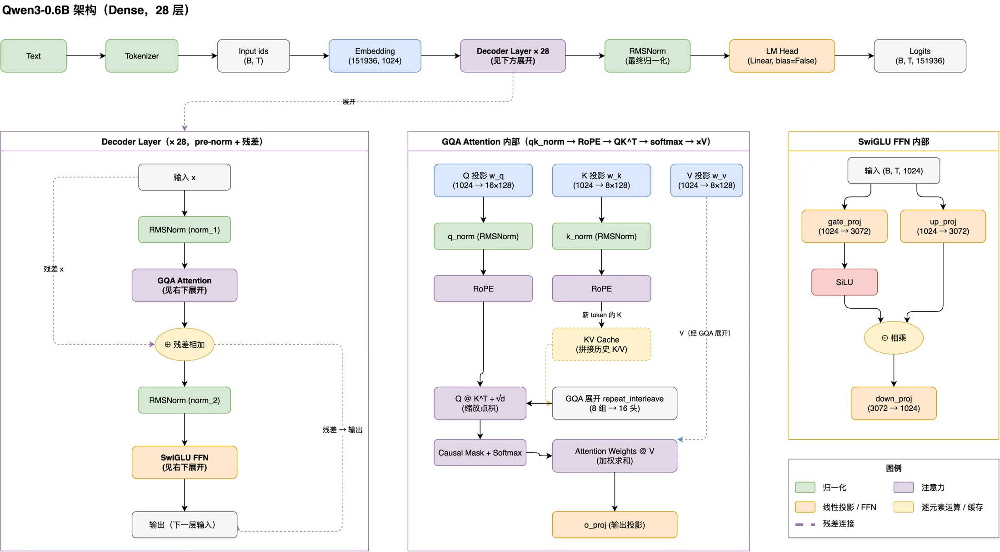
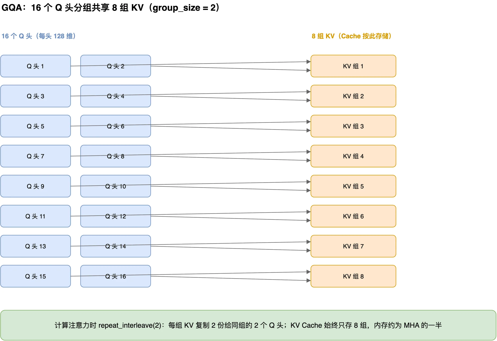
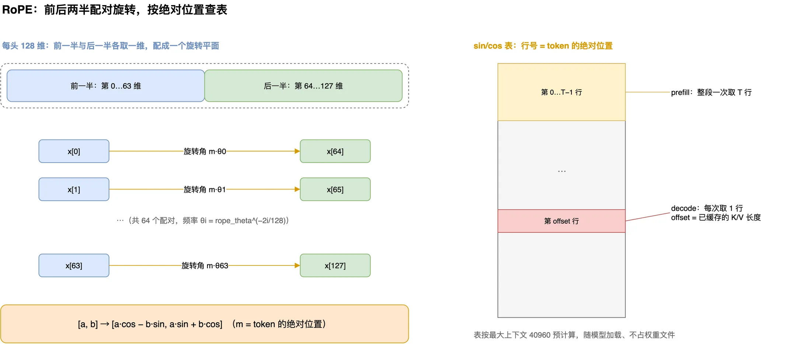
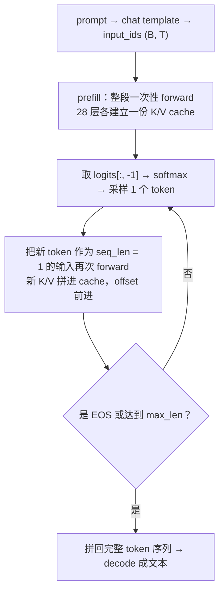

Qwen3 系列只有两种骨架：小模型是纯 Dense（0.6B～32B），大模型才用 MoE（30B-A3B、235B-A22B，A3B 表示激活参数约 3B）。如果想把 Qwen3 的实现看明白，0.6B 是最合适的起点——结构完整、没有路由和专家调度这些干扰项，而且权重开源、尺寸小到能在笔记本上跑对话生成。

本文以 ai-from-scratch 系列的 mini-qwen3 仓库为例，按「配置文件 → 模型骨架 → 每个子模块 → 加载权重 → 生成 → MoE」的顺序，把代码逐段讲清楚。对照着 [Qwen3-0.6B 官方模型卡](https://huggingface.co/Qwen/Qwen3-0.6B) 和 [技术报告](https://arxiv.org/abs/2505.09388) 读效果更好；想横向比较各家模型怎么选型这些模块，可以看站内的《[一张表看懂 2026 年主流大模型的架构选择](/posts/llm-architecture-2026/)》。

## mini-qwen3 是什么

mini-qwen3 的目标是用纯 PyTorch 从零复刻 Qwen3-0.6B，不依赖 transformers 的模型实现（分词器暂时借用官方 AutoTokenizer，见仓库 TODO）。实现部分由十来个相互独立的短文件组成，每个文件对应架构里的一块：

| 文件            | 内容                                                        |
| --------------- | ----------------------------------------------------------- |
| `config.py`     | 模型配置，TypedDict，字段名与数值均与官方 config.json 一致（`qk_norm` 除外） |
| `rms_norm.py`   | RMSNorm                                                     |
| `rope.py`       | RoPE 旋转位置编码 + sin/cos 预计算表                        |
| `ffn.py`        | SwiGLU FFN                                                  |
| `gqa.py`        | GQA 注意力（QK 归一化、KV Cache）                           |
| `tf_block.py`   | TransformerBlock（pre-norm + 残差）                         |
| `model.py`      | 整体模型：Embedding + 28 层 + 最终归一化 + LM Head          |
| `moe.py`        | MoE 专家混合（TopKRouter + 融合 gate/up），Dense 模型不启用 |
| `load_qwen3.py` | 加载官方 safetensors 权重（名字映射 + 形状校验）            |
| `generate.py`   | 对话生成（chat template + KV Cache 逐 token 解码）          |
| `profiling.py`  | 参数量 / 内存 / 延迟统计                                    |
| `device.py`     | 设备选择（CUDA → MPS → CPU）                                |
| `tokenizer.py`  | 分词器（计划自研，当前借用官方 AutoTokenizer）              |
| `tests/`        | 按模块拆分的单元测试 + 模型集成测试                         |

运行方式（首次生成需下载约 1.2GB 权重）：

```bash
uv sync --all-packages                          # 装依赖
uv run python tests/run_tests.py                # 全部测试
uv run python generate.py                       # 对话生成
uv run python profiling.py                      # 资源占用统计（随机权重，免下载）
```

仓库自带一张完整架构图，后面的章节会按它的结构逐块展开：



:::caption
mini-qwen3 README 的架构图：主链是 28 层 Dense Decoder，下方两张内嵌图分别展开 GQA 注意力和 SwiGLU FFN 的内部数据流。
:::

## 配置文件：先把每个数字说清楚

`config.py` 用 TypedDict 把全部超参集中到一份配置里，字段按官方 `config.json` 的语义命名。

| 字段（与官方 config.json 同名） | 含义               |                                   数值 |
| ------------------------------- | ------------------ | -------------------------------------: |
| `vocab_size`                    | 词表大小           |                                151,936 |
| `max_position_embeddings`       | 上下文长度         |                                 40,960 |
| `hidden_size`                   | 隐藏维             |                                   1024 |
| `num_hidden_layers`             | 层数               |                                     28 |
| `num_attention_heads`           | 注意力头数         |                                     16 |
| `num_key_value_heads`           | KV 组数            |                                      8 |
| `head_dim`                      | 每头维度           |                                    128 |
| `intermediate_size`             | FFN 中间维         |                                   3072 |
| `rope_theta`                    | RoPE 的 theta      |                                    1e6 |
| `torch_dtype`                   | 参数字节类型       |                               bfloat16 |
| `qk_norm`                       | 是否对 Q、K 归一化 | True（仓库保留，官方 config 无此字段） |

两个值得注意的点：

- **head_dim 是独立超参**。16 头 × 128 维 = 2048，大于隐藏维 1024。也就是说 Q 的投影不是常见的「hidden → hidden 再均分」，而是显式升到 2048 再切成 16 个 128 维的头。后面讲 GQA 时会看到这正是它能和隐藏维解耦的原因。
- **qk_norm 是仓库自加的开关**。官方 `config.json` 里没有这个字段；但官方权重里带着 `q_norm.weight`、`k_norm.weight`，说明 Qwen3 的注意力包含对 Q、K 的逐头归一化。仓库把它暴露成布尔开关，便于对照实验，默认开启。

其余没进 `config.py` 的超参都藏在各模块的构造参数里：`rms_norm_eps = 1e-6` 对应每个 RMSNorm 的 `eps`，官方 `attention_bias = false`、MLP 无 bias 对应所有线性层 `bias=False`，`tie_word_embeddings = true` 则影响 Embedding 与 LM Head 是否共享权重（仓库没做共享，见骨架一节）。

把配置单独拎出来的直接收益在加载阶段兑现：`load_qwen3.py` 在拷贝权重前逐参数比对形状，config 与官方任何一处不一致都会立刻报错，而不是把错位的张量静默拷进模型。细节见后文。

## 骨架：token 怎么走完整个模型

`model.py` 的 `Qwen3` 类只有 5 个部件，`forward` 很短：

```python title="model.py（节选）"
class Qwen3(nn.Module):
    def __init__(self, config: QwenConfig):
        super().__init__()
        self.embedding = nn.Embedding(config["vocab_size"], config["hidden_size"])
        self.tf_blocks = nn.ModuleList([TransformerBlock(config) for _ in range(config["num_hidden_layers"])])
        self.norm = RMSNorm(config["hidden_size"])
        self.out = nn.Linear(config["hidden_size"], config["vocab_size"], bias=False)

        sin, cos = build_rope_table(
            head_dim=config["head_dim"],
            context_len=config["max_position_embeddings"],
            theta_base=config["rope_theta"],
        )
        self.register_buffer("sin", sin, persistent=False)
        self.register_buffer("cos", cos, persistent=False)
        self.offset = 0

    def forward(self, in_idx: Tensor, cache: dict):
        x = self.embedding(in_idx)          # (batch, seq_len, emb_dim)

        seq_len_total = self.offset + seq_len
        mask = torch.ones(seq_len_total, seq_len_total, device=x.device, dtype=torch.bool)
        mask = torch.triu(mask, diagonal=1)
        if self.offset > 0:                  # decode 阶段只保留当前块的因果行
            mask = mask[-seq_len:, :]

        for i, block in enumerate(self.tf_blocks):
            kv_cache = cache.get(i)
            x, next_cache = block(x, mask=mask, sin=self.sin, cos=self.cos, kv_cache=kv_cache)
            cache[i] = next_cache            # 每层的 K/V 缓存写回外部 dict

        x = self.norm(x)
        logits: Tensor = self.out(x)         # (batch, seq_len, vocab_size)
        self.offset = seq_len_total
        return logits
```

形状一路是 `(batch, seq_len, emb_dim)`：`(B, T)` 的 token id 查表变成 `(B, T, 1024)`，28 个块原地变换，最后过一个 RMSNorm 和一个 `Linear(1024 → 151936)` 得到 `(B, T, 151936)` 的 logits。

RoPE 的 sin/cos 表（`(40960, 128)` 两张）注册为 `persistent=False` 的 buffer，随模型移动设备但不进 state_dict——它由公式算出，不属于权重。官方 config 里 `tie_word_embeddings = True`，即 Embedding 与 LM Head 共享同一份词表矩阵；仓库没有做共享，两个 151,936 × 1024 的矩阵各自持有（官方权重文件里两份内容相同的张量也都保存着，加载时各自拷贝即可，行为等价）。后面 profiling 会看到，这直接造成实测参数量比官方口径多出约 1.6 亿。

### prefill 与 decode：同一次 forward 的两种形态

注意 `forward` 的输入不是「整个序列」，而是「当前这一次要算的 token 们」，历史 token 在 KV Cache 里。因此有两种调用方式：

- **prefill（预填充）**：`self.offset == 0`，一次性喂入整段 prompt，`mask` 是完整的 `(T, T)` 因果上三角。算完后每层都把整段 K/V 存进 `cache[i]`。
- **decode（逐 token 生成）**：`self.offset > 0`，每步只喂 `seq_len = 1` 的最后一个 token。此时 `mask[-seq_len:, :]` 取的是全量因果矩阵的最后一行——这一行的「未来列」本来就在上三角之外，全是 False，于是唯一的新 token 能看到包括自己在内的全部历史位置。

因果 mask 用 `torch.triu(ones, diagonal=1)` 生成：主对角线以上的位置为 True，对应「未来的 token」，在注意力里被 `masked_fill(..., -inf)` 屏蔽。RoPE 的 `offset` 也由缓存的长度推导（见 GQA 一节），保证新 token 拿到的位置编码是它在整段对话里的绝对位置，而不是每步都从 0 开始。

## RMSNorm：把激活值拉回稳定区间

`rms_norm.py` 实现的是均方根归一化，LayerNorm 的简化版——不做减均值，只按均方根缩放：

```python title="rms_norm.py（节选）"
def forward(self, x: Tensor):
    x_dtype = x.dtype
    if self.qwen3_compatible:                 # 与官方一致：先升到 fp32 计算
        x = x.to(torch.float32)
    variance = x.pow(2).mean(dim=-1, keepdim=True)
    x_norm = x * torch.rsqrt(variance + self.eps) * self.weight
    return x_norm.to(x_dtype)
```

$$
\hat{x}_i = \frac{x_i}{\sqrt{\frac{1}{d}\sum_j x_j^2 + \epsilon}} \cdot w_i
$$

实现里有三个与数值有关的细节：

- **fp32 里算**。模型主体是 bf16，但归一化这一步先升到 float32 再算，最后降回原精度。原因是 norm 在每层都要做、累积误差会被放大，bf16 直接算容易漂移。仓库用 `qwen3_compatible` 开关控制这一行为，默认开。
- **`rsqrt` 而不是 `sqrt` 再除**。`torch.rsqrt` 直接给平方根的倒数，省一步除法，是深度学习中常见的写法。
- **`eps = 1e-6`** 与官方 `rms_norm_eps` 一致，避免分母为 0。

RMSNorm 是当前 LLM 的事实标准。在 Qwen3 里它反复出现：每个 TransformerBlock 的 `norm_1` / `norm_2`、GQA 内部的 QK 归一化，以及模型末端的最终归一化。整个仓库只有这一个归一化实现，后面会看到各处复用同一个类。

## GQA 注意力：Q、K、V 的三种投影

`gqa.py` 是最核心的一个文件。先看构造：16 个 query 头，但只有 8 组 KV，每组服务 `group_size = 16 / 8 = 2` 个 query 头。投影维度因此不对称：

```python title="gqa.py（构造节选）"
d_out = n_heads * head_dim            # 16 × 128 = 2048
self.w_q = nn.Linear(d_in, d_out, bias=bias)          # 1024 → 2048
self.w_k = nn.Linear(d_in, n_kv_groups * head_dim, bias=bias)   # 1024 → 1024
self.w_v = nn.Linear(d_in, n_kv_groups * head_dim, bias=bias)   # 1024 → 1024
self.w_out = nn.Linear(d_out, d_in, bias=bias)        # 2048 → 1024

self.q_norm = RMSNorm(head_dim) if qk_norm else None  # 每头 128 维上归一化
self.k_norm = RMSNorm(head_dim) if qk_norm else None
```

这正是前面说的「head_dim 独立超参」的直接结果：KV 的维度 `8 × 128 = 1024` 恰好等于隐藏维，所以 `w_k`、`w_v` 不升维；Q 的维度 `16 × 128 = 2048` 超过隐藏维，`w_q` 显式升维，最后由 `w_out` 收回 1024。

forward 的流程对应架构图右下那张展开图（其中 RoPE 的细节下一节展开，这里先把它理解为给 Q、K 按绝对位置打标签）：

```python title="gqa.py（forward 节选）"
q = q.reshape(batch_size, seq_len, self.n_heads, -1).transpose(1, 2)   # (B, 16, S, 128)
k = k.reshape(batch_size, seq_len, self.n_kv_groups, -1).transpose(1, 2)  # (B, 8, S, 128)
v = v.reshape(batch_size, seq_len, self.n_kv_groups, -1).transpose(1, 2)  # (B, 8, S, 128)

if self.q_norm: q = self.q_norm(q)      # QK 归一化，在 RoPE 之前
if self.k_norm: k = self.k_norm(k)
q = apply_rope(q, sin=sin, cos=cos, offset=offset)   # offset = 已缓存长度
k = apply_rope(k, sin=sin, cos=cos, offset=offset)

if kv_cache:
    k_cache, v_cache = kv_cache
    k = torch.cat([k_cache, k], dim=-2)               # 沿序列维拼接历史
    v = torch.cat([v_cache, v], dim=-2)
next_cache = (k, v)

k = k.repeat_interleave(self.group_size, dim=1)       # 8 组 → 16 头，每组复制 2 份
v = v.repeat_interleave(self.group_size, dim=1)

attn_score = q @ k.mT
attn_score = attn_score.masked_fill(mask, -torch.inf)
attn_weight = torch.softmax(attn_score / self.head_dim**0.5, dim=-1)
context = attn_weight @ v
context = context.transpose(1, 2).reshape(batch_size, seq_len, -1)
return self.w_out(context), next_cache
```

几个要点：

- **GQA 省内存的关键在缓存维度**。KV Cache 按 8 组存储（`k_cache.shape[-2]` 也因此能直接当 RoPE offset 用），到计算注意力时才用 `repeat_interleave(group_size, dim=1)` 把每组 KV 复制成 2 份给对应的 2 个 query 头用。缓存只存 8 份而不是 16 份，长上下文下的内存几乎减半（MHA 要存 16 份）。
- **缩放系数是 `head_dim^-0.5`，不是隐藏维**。softmax 前除以 $\sqrt{128}$，防止高维内积把权重推向 0/1 的极端。这正对应官方的 `head_dim = 128`。
- **QK 归一化在 RoPE 之前做**，每头 128 维上各算一次 RMSNorm，`q_norm`、`k_norm` 直接复用 `rms_norm.py` 的类。

这层分组共享关系可以画成下图：左边 16 个 Q 头两两一组，右边 8 组 KV，每组只服务本组的 2 个 Q 头。



:::caption
GQA 的分组共享：每 2 个 Q 头共用 1 组 KV。缓存只存 8 组（内存约为 MHA 的一半），到算注意力时才用 repeat_interleave 复制回 16 份。
:::

注意力公式可以浓缩成：

$$
\text{Attn}(Q,K,V)=\text{softmax}\!\left(\frac{QK^\top}{\sqrt{d_{\text{head}}}}+M\right)V,\qquad M_{ij}=\begin{cases}0, & j\le i\\ -\infty, & j>i\end{cases}
$$

KV Cache 的内存与序列长度成正比：每 token 每层约 4KB（bf16 下 8 组 × 128 维 × K、V 两份 × 2 字节），28 层就是每 token 约 112KB。短对话无感，长上下文时它才是显存大头。

## RoPE：旋转位置编码

`rope.py` 做两件事：预计算一张 `(40960, 128)` 的 sin/cos 表，以及在前向里按位置「旋转」Q 和 K。频率只算一半维度，另一半共享同一份：

```python title="rope.py（节选）"
freqs = torch.arange(0, head_dim, 2, dtype=dtype)        # [0, 2, 4, ..., head_dim-2]
freqs = theta_base ** (freqs / -head_dim)                # theta^(-2i/d)
angle = positions.unsqueeze(-1) @ freqs.unsqueeze(0)     # (context_len, head_dim // 2)
angle = torch.cat([angle, angle], dim=-1)                # 前后两半共享同一频率
return angle.sin(), angle.cos()
```

于是第 $i$ 维与第 $i + d/2$ 维配对成一组，旋转公式是：

$$
\theta_i = \mathrm{theta\_base}^{-\frac{2i}{d}}, \qquad
\begin{bmatrix}a\\ b\end{bmatrix} \mapsto
\begin{bmatrix}
a\cos(m\theta_i) - b\sin(m\theta_i)\\
a\sin(m\theta_i) + b\cos(m\theta_i)
\end{bmatrix}
$$

`apply_rope` 里对应这行：

```python title="rope.py（forward 节选）"
a = x[..., : head_dim // 2]
b = x[..., head_dim // 2:]
sin = sin[offset : offset + seq_len, :]     # 按绝对位置取表
cos = cos[offset : offset + seq_len, :]
return sin * torch.cat([-b, a], dim=-1) + cos * x
```

配对旋转与查表两步合起来如下图：



:::caption
左：第 i 维与第 i + 64 维配成一个旋转平面，旋转角 m·θᵢ 随 token 的绝对位置 m 增长。右：sin/cos 表的行号就是绝对位置——prefill 一次取 T 行，decode 每步取第 offset 行（offset = 已缓存长度）。
:::

- **配对方式是「前后两半」**：8 维向量的配对是 `(0,4)、(1,5)、(2,6)、(3,7)`，与 Qwen 官方 `rotate_half` 的实现一致。另一种常见做法是相邻维度配对（GPT-NeoX 风格）。两种只是把 d 维切成 d/2 个旋转平面时选的配对不同，编码的是同一组频率——这一点在看别家实现时常会困惑。
- **`theta_base = 1e6` 是 Qwen3 的选择**。theta 越大，相邻位置的旋转角差越小，位置信号随 token 间距的变化更平缓，长上下文的数值行为更稳（Llama 系常见 1e4）。这也解释了为什么表要按最大上下文 40960 预计算：`sin[offset:offset+seq]` 直接按行切片，decode 时一个 token 一行。

## SwiGLU FFN：带门控的前馈

`ffn.py` 是标准的 SwiGLU：三个投影、`bias=False`，中间用 SiLU 门控：

```python title="ffn.py（节选）"
x_1 = self.up_proj(x)          # 1024 → 3072
x_2 = self.gate_proj(x)        # 1024 → 3072
x = x_1 * nn.functional.silu(x_2)
return self.down_proj(x)       # 3072 → 1024
```

$$
\text{FFN}(x) = W_{\text{down}}\,\big(\text{SiLU}(W_{\text{gate}}\, x) \odot W_{\text{up}}\, x\big)
$$

与 ReLU、GELU 的单路激活不同，GLU 家族是「主分支 × 门控分支」的双分支结构：`up_proj` 提供内容，`gate_proj` 过 SiLU 后决定放行多少。SwiGLU 在效果与训练稳定性上的综合表现使其成为 Qwen、DeepSeek 等主流模型的事实默认。

## TransformerBlock：pre-norm + 残差

`tf_block.py` 把上面几块拼起来，一层的结构非常朴素：

```python title="tf_block.py（节选）"
def forward(self, x, mask, sin, cos, kv_cache=None):
    residual = x
    x = self.norm_1(x)
    x, next_cache = self.attn(x, mask, sin, cos, kv_cache)   # GQA 注意力
    x = x + residual

    residual = x
    x = self.norm_2(x)
    x = self.ffn(x)                                          # SwiGLU FFN
    x = x + residual
    return x, next_cache
```

每层 = pre-norm（先归一化再进子层）+ 残差连接，注意力与 FFN 各做一次。28 层在 `model.py` 里用 `ModuleList` 串起来，输出逐层向下传，与架构图主链一致。Qwen3 走的是标准 Pre-LN：只有子层前的 `norm_1`/`norm_2`，加上注意力内部对 Q、K 的归一化，没有额外后置归一化。想对比 Pre-Norm、Post-Norm 这些路线的差异，站内的架构大表文章里有专门小节。

## 加载官方权重：名字映射与双重校验

架构写对了不等于能跑出正确结果——权重必须来自官方。`load_qwen3.py` 做的事情是：从 HF 下载官方 safetensors，把官方参数名映射成本仓库的名字，逐参数拷贝。名字映射的规律一眼能看懂：

```python title="load_qwen3.py（映射节选）"
m = {
    "model.embed_tokens.weight": "embedding.weight",
    "model.norm.weight": "norm.weight",
    "lm_head.weight": "out.weight",
}
for i in range(QWEN_CONFIG_0_6_B["num_hidden_layers"]):
    m |= {
        f"model.layers.{i}.input_layernorm.weight":   f"tf_blocks.{i}.norm_1.weight",
        f"model.layers.{i}.post_attention_layernorm.weight": f"tf_blocks.{i}.norm_2.weight",
        f"model.layers.{i}.self_attn.q_proj.weight":  f"tf_blocks.{i}.attn.w_q.weight",
        # ... k_proj / v_proj / o_proj / q_norm / k_norm / mlp 的 gate、up、down 同理
    }
```

拷贝前有两道校验，防止静默错位：

```python title="load_qwen3.py（校验节选）"
for official_name, mine in name_map.items():
    assert official_name in official, f"官方权重缺少 {official_name}"
    o_shape = tuple(official[official_name].shape)
    m_shape = tuple(model.get_parameter(mine).shape)
    assert o_shape == m_shape, f"shape 不匹配: {official_name} {o_shape} vs {mine} {m_shape}"

missing = [n for n, _ in model.named_parameters() if n not in name_map.values()]
assert not missing, f"模型参数未覆盖: {missing}"
```

第一道逐个确认官方 key 存在且形状一致——只要 config 或某个投影的维度写错，这里立刻报出具体名字；第二道反向检查模型的每个参数都被映射覆盖，杜绝「官方有、模型没建」的遗漏。两道都过之后才在 `no_grad` 下拷贝。这套「正反双向校验」的思路值得抄：任何从外部加载权重的代码，只校验一个方向都可能在另一个方向上静默出错。

## 对话生成：缓存如何跨步复用

`generate.py` 把前面所有部分串成一次对话。整体是一个 prefill 加多步 decode 的循环：



```python title="generate.py（节选）"
kv_cache = {}
model.reset_kv_cache()
with torch.no_grad():
    for _ in range(max_len):
        logits = model.forward(in_idx=in_idx, cache=kv_cache)  # (B, S, vocab)
        logits = logits[:, -1, :]                               # 只看最后一行
        probs = logits.softmax(dim=-1)
        in_idx = probs.multinomial(1)                           # 按概率采样
        final_idx = torch.cat([final_idx, in_idx], dim=-1)
        if in_idx[0][0] == tokenizer.eos_token_id:
            break
```

三个值得注意的设计：

- **`kv_cache` 是生成循环外的普通 dict**。它按层索引存每层的 `(k, v)`，跨 forward 调用存活，是 KV Cache 真正的载体；`reset_kv_cache()` 只重置 `offset`，配合每次调用传入同一个 `cache` dict，28 层的历史就自然累积了。想清空缓存只需换一个新的空 dict。
- **采样而非贪心**：`softmax` 后 `multinomial(1)` 按概率抽样，让输出有随机性。
- **思考模式可见于真实输出**。仓库注释里保留了一段当时运行 Qwen3-0.6B 的真实输出：模型先输出一段 `<think>……</think>` 的内部推理，再给出最终回答。这就是 Qwen3 的混合思考模式——先「想」再「答」；思考块会原样出现在流式输出里，按官方推理指南可以在模板层关闭，省掉这部分开销。

## MoE：为 30B-A3B 预留的路由

0.6B 是 Dense 模型，28 层全部用普通 SwiGLU FFN，`moe.py` 在推理时不会被调用。但仓库把它单独实现出来，是为了将来替换 `tf_block.py` 里的 FFN 就能往 Qwen3-MoE（30B-A3B / 235B-A22B）方向扩展。

MoE 的核心是「每个 token 只激活少数几个专家」。路由部分：

```python title="moe.py（TopKRouter 节选）"
router_logits = F.linear(hidden_states, self.weight)          # (S, num_experts)
router_probs = router_logits.softmax(-1, dtype=torch.float)   # 路由在 fp32 下决策
top_k_probs, top_k_indices = router_probs.topk(self.top_k, dim=-1)
if self.norm_topk_prob:
    top_k_probs /= top_k_probs.sum(dim=-1, keepdim=True)      # top-k 内重新归一化
```

- 每个 token 对全部专家算一个打分，取 top-k（30B-A3B 的配置是 128 个专家、每 token 激活 8 个），选出最相关的几个。
- 路由在 fp32 下算，因为专家选择的均衡性直接影响负载与效果，低精度会放大打分误差；算完再转回原精度。
- `norm_topk_prob = True` 时把选中专家的权重在 top-k 内部重新归一化，保证对每个 token 的加权和仍是 1。这是 Qwen 系配置的默认行为。

专家计算部分把常规的 gate/up 两个投影融合成一个参数，且只对「本轮被选中的专家」执行计算：

```python title="moe.py（Experts 节选）"
# 权重布局：num_experts 在 batch 维
self.gate_up_proj = nn.Parameter(torch.empty(num_experts, 2 * moe_intermediate_size, hidden_size))
self.down_proj = nn.Parameter(torch.empty(num_experts, hidden_size, moe_intermediate_size))

# 只遍历本轮命中的专家，其余专家不产生任何计算
expert_hit = expert_mask.sum((-1, -2)).greater(0).nonzero()
for (expert_idx,) in expert_hit:
    gate, up = F.linear(hidden_states[token_idx], self.gate_up_proj[expert_idx]).chunk(2, dim=-1)
    current = F.linear(F.silu(gate) * up, self.down_proj[expert_idx])
    current = current * router_score[token_idx, top_k_idx, None]
    final_hidden_states.index_add_(0, token_idx, current)     # 加权累加回对应行
```

稀疏性的代价是路由打分、top-k 选择、命中统计这些调度开销；收益是同样参数规模下每 token 只算 k 个专家，激活参数远小于总参数——这就是 30B-A3B 里「A3B」的含义。仓库的测试里有一个 `test_moe_matches_tokenwise_reference`，把稀疏实现和逐 token 稠密参考结果做一致性校验，防止「省了计算却算错数」。

## 测试与实测数字

测试按模块拆分在 `tests/` 下（`test_rms_norm`、`test_rope`、`test_ffn`、`test_gqa`、`test_tf_block`、`test_moe`、`test_model`），`run_tests.py` 统一入口，其中 `test_qwen3_prefill_and_generate` 是模型级集成测试，覆盖 prefill + decode 全链路。本文撰写当天本机全部通过。

仓库的 `profiling.py` 用随机权重（无需下载）统计资源占用。在作者机器（Apple Silicon、MPS、bf16）上的实测值：

| 指标              | 数值                      |
| ----------------- | ------------------------- |
| 参数量            | 0.752B                    |
| fp32 权重理论内存 | 3.01GB（bf16 下约 1.5GB） |
| prefill 8 tokens  | 约 140ms                  |
| decode            | 约 18 tokens/s            |
| 进程峰值 RSS      | 约 3.2GB                  |

两点说明：0.752B 高于官方「0.6B」口径，原因正是前面说的仓库没做 Embedding/LM Head 权重共享，多出约 1.6 亿参数；RSS 3.2GB 包含 PyTorch 运行时本身的开销，不代表权重大小。这些数字是逐层 Python 前向、未做算子融合也未编译的结果，只作量级参考——同一份代码换 GPU 或加 `torch.compile` 会差出很多。

## 参考资料与延伸阅读

- mini-qwen3 仓库（ai-from-scratch 系列）
- Qwen3 技术报告：<https://arxiv.org/abs/2505.09388>
- Qwen3-0.6B 模型卡与 config：<https://huggingface.co/Qwen/Qwen3-0.6B>
- RoPE 旋转位置编码：<https://arxiv.org/abs/2104.09864>
- GQA 分组查询注意力：<https://arxiv.org/abs/2305.13245>
- SwiGLU：<https://arxiv.org/abs/2002.05202>
- RMSNorm：<https://arxiv.org/abs/1910.07467>
- 站内延伸：[《一张表看懂 2026 年主流大模型的架构选择》](/posts/llm-architecture-2026/)、[《图解 Transformer：注意力机制到底在算什么》](/posts/transformer-attention/)
