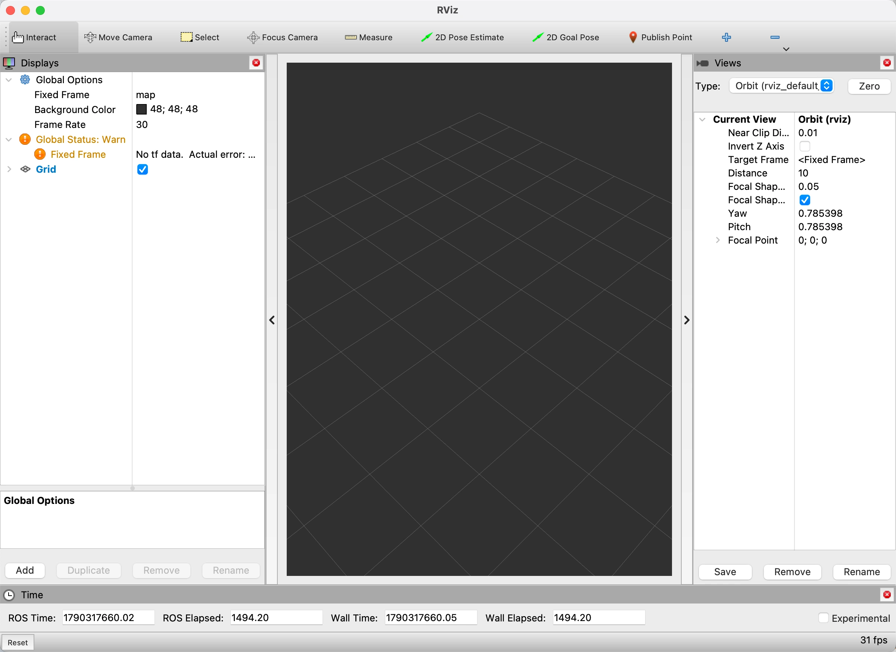
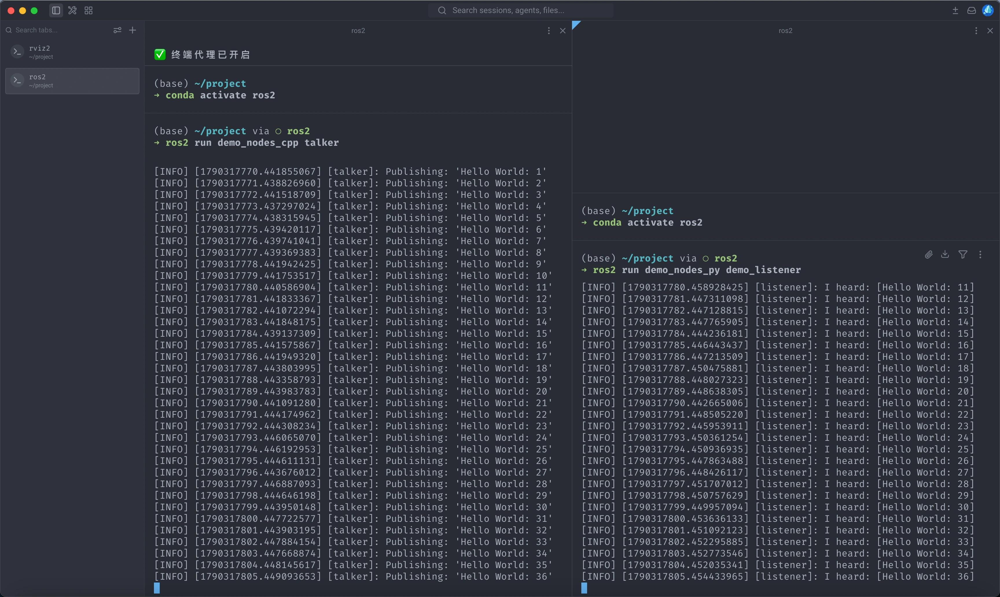

在 Apple Silicon 上按官方文档源码编译 ROS2，依赖包失败率极高，环境还没搭好就先被编译问题劝退。

这里记录一条曲线路径：用 **Anaconda 建虚拟环境，再通过 RoboStack 安装预编译的 `ros-humble-desktop-full`**，绕开源码编译。RoboStack 把 ROS 包预先编译成 conda 包，安装时直接拉二进制，省去本地编译的整条链路。

## 前置条件

- Apple Silicon（本文在 M1 Pro 上验证）
- 已安装 Anaconda（未装的话先自行安装）

## 步骤

### 1. 安装 mamba

mamba 是 conda 的更快前端，依赖求解速度明显更好：

```bash
conda install mamba -c conda-forge
```

### 2. 创建 ROS2 虚拟环境

```bash
conda create -n ros2 python=3.10
conda activate ros2

conda config --env --add channels conda-forge
conda config --env --add channels robostack-staging
conda config --env --remove channels defaults
```

关键在 `robostack-staging`：ROS 包已经预编译成 conda 包，装的就是二进制，不必再源码编译。

### 3. 安装 Humble 与工具链

```bash
conda install ros-humble-desktop-full
conda install compilers cmake pkg-config make ninja colcon-common-extensions catkin_tools rosdep
```

### 4. 验证

先启动可视化工具：

```bash
rviz2
```

能打开 RViz 界面即说明可视化工具链可用：



:::caption{size=70}
图 1：rviz2 在 Apple Silicon 上的启动界面
:::

再开两个终端，分别跑官方 example（每个终端都要先 `conda activate ros2`）：

```bash
# 终端 A：C++ 版 talker
ros2 run demo_nodes_cpp talker

# 终端 B：Python 版 listener
ros2 run demo_nodes_py demo_listener
```

看到 talker 持续 `Publishing`、listener 持续 `I heard`，说明 C++ 与 Python API 都工作正常。



:::caption{size=100}
图 2：左为 C++ 版 talker，右为 Python 版 listener，消息依次递增
:::

> [!CAUTION]
> 命名有坑：从 Humble 起，Python 版可执行文件为避免与 C++ 版重名，改成了 `demo_talker` / `demo_listener`；
> C++ 版仍是 `demo_nodes_cpp talker` / `listener`。直接运行 `ros2 run demo_nodes_py listener` 会报
> `No executable found`。用 `ros2 pkg executables demo_nodes_py` 可以查看实际名称。

## 关键点

- 版本组合固定：**Python 3.10 + ROS2 Humble**。
- `conda config --env` 只作用于当前环境，不会污染 base。
- 每开一个新终端都要先 `conda activate ros2`，否则 `ros2`、`rviz2` 等命令不可用。
- 这是 conda 包方案，不是官方支持的原生安装，部分实时或底层功能可能受限。

## 小结

| 目标           | 做法                                   |
| -------------- | -------------------------------------- |
| 避开源码编译   | RoboStack 预编译的 conda 二进制包      |
| 环境隔离       | `conda create -n ros2` 独立虚拟环境    |
| 完整桌面工具链 | `ros-humble-desktop-full` + 编译工具集 |

源码编译走不通时，conda 二进制方案是一条务实的退路：装得快、隔离干净，代价是偏离官方原生安装路径，实时性等底层能力需要另行评估。

## 参考

- 原始出处：<https://blog.csdn.net/qq_41650747/article/details/148905540>
