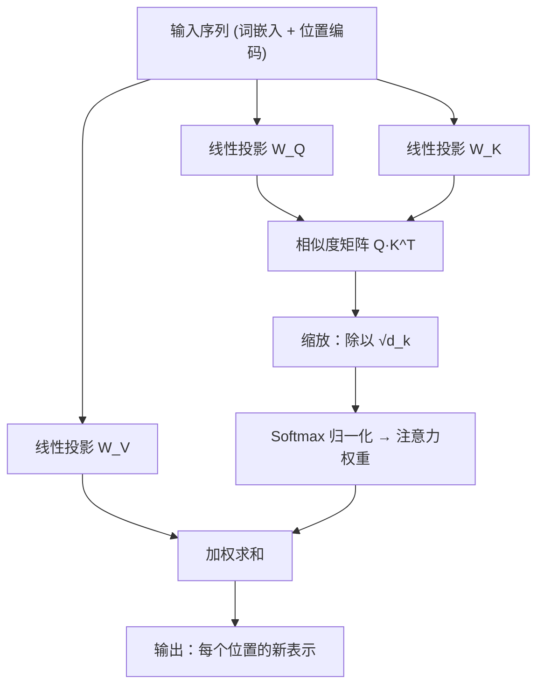
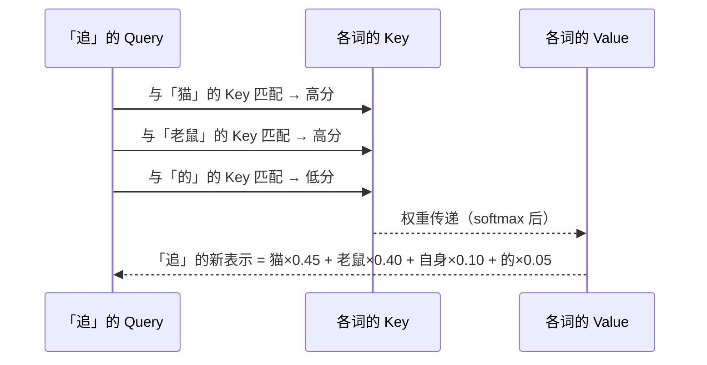

读《Attention Is All You Need》的时候，最大的障碍不是公式，而是公式背后**到底在发生什么**。
这篇用一次「图书馆检索」的类比 + 两张图，把 Self-Attention 拆开看。

## 一句话直觉

> 每个词都带着三个身份出场：它想找什么（Query）、它有什么可以被找到（Key）、
> 以及它实际携带的信息（Value）。

Attention 的全部工作，就是让每个词用 Query 去和所有词的 Key 对暗号，
按匹配程度把大家的 Value 加权汇总回来。

## 数据流全景



注意 $Q$、$K$、$V$ 是**同一个输入**经过三个不同线性层得到的——
这正是「自」注意力（Self-Attention）的含义：序列自己关注自己。

## 缩放点积注意力

整个机制浓缩成一个公式：

$$
\mathrm{Attention}(Q, K, V) = \mathrm{softmax}\!\left(\frac{QK^T}{\sqrt{d_k}}\right)V
$$

从左到右过一遍：

| 步骤     | 运算               | 形状 (序列长 $n$、维度 $d_k$) | 在做什么                  |
| -------- | ------------------ | :---------------------------: | ------------------------- |
| ① 相似度 | $QK^T$             |         $n \times n$          | 两两点名，得到原始匹配分  |
| ② 缩放   | $\div \sqrt{d_k}$  |         $n \times n$          | 防止高维内积过大          |
| ③ 归一化 | $\mathrm{softmax}$ |         $n \times n$          | 把匹配分变成和为 1 的权重 |
| ④ 聚合   | $\cdot V$          |        $n \times d_v$         | 按权重抄写并汇总信息      |

### 为什么必须除以 √d_k

假设 $q$、$k$ 的分量是均值 0、方差 1 的独立随机变量，那么内积
$q \cdot k = \sum_{i=1}^{d_k} q_i k_i$ 的方差是 $d_k$。
维度越高，点积的绝对值越大，softmax 越容易把权重推向 0/1 的极端——
梯度几乎消失，训练就僵死了。除以 $\sqrt{d_k}$ 恰好把方差拉回 1：

$$
\mathrm{Var}\!\left(\frac{q \cdot k}{\sqrt{d_k}}\right) = 1
$$

## 一个 4 词的迷你例子

「猫 追 老鼠 的」——当「追」在做检索时：



经过这一轮，「追」不再只是词典里的动词——它携带了主语和宾语的信息。
多层堆叠之后，顶层表示就能支撑起「谁追了谁」这样的推理。

> [!NOTE]
> 多头注意力（Multi-Head）没有任何神秘：把上面整套流程复制 $h$ 份，
> 每份用不同的投影矩阵关注不同的关系子空间（语法、指代、位置……），最后拼起来再投影一次。

## 手写一个最小实现

理解公式最好的方式是写一遍。NumPy 版核心只有五行：

```python title="attention.py"
import numpy as np

def softmax(x, axis=-1):
    x = x - x.max(axis=axis, keepdims=True)  # 数值稳定
    e = np.exp(x)
    return e / e.sum(axis=axis, keepdims=True)

def attention(Q, K, V, mask=None):
    d_k = Q.shape[-1]
    scores = Q @ K.T / np.sqrt(d_k)          # ①② 相似度 + 缩放
    if mask is not None:
        scores = np.where(mask, scores, -np.inf)  # 因果掩码
    weights = softmax(scores)                # ③ 归一化
    return weights @ V                       # ④ 加权聚合
```

> [!WARNING]
> 生产环境请直接用框架实现（PyTorch 的 `F.scaled_dot_product_attention`），
> 它在算子融合和 FlashAttention 内存优化上比朴素实现快得多。手写版的价值仅在于理解。

## 小结

注意力机制没有魔法，它只是把一个朴素的问题算得极其高效：
**给定一个查询，从一堆候选里按相关度取回信息。**
下一个值得啃的问题自然是：位置编码是怎么把「顺序」塞进这场无序的检索里的——
那是下一篇的主题。
